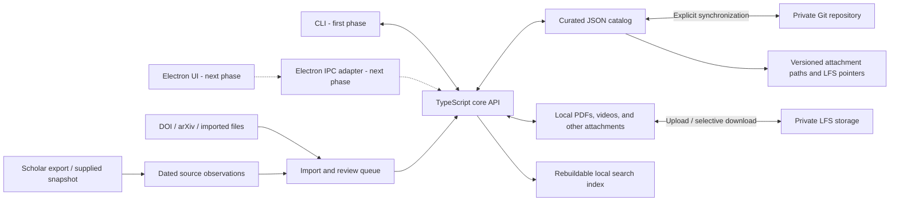

# MyPub — proposed design

Draft for discussion · 6 September 2026 · No implementation or external account setup yet.

Build a reusable TypeScript core and a command-line interface over a portable, versioned publication catalog. Add an Electron UI in the next phase. Store curated metadata as one readable JSON file per publication and synchronize through a private Git repository. Store publication PDFs and other attachments under the same repository layout using Git LFS, with selective downloads on each computer. Use external sources to propose metadata changes and supply dated citation observations. Your accepted records remain authoritative. Publications are the only bibliographic entity; optional relations connect related publications without a parent “Work” layer.

The first phase runs locally through a CLI and an importable TypeScript API. The later Electron application will call the same operations. A browser interface, HTTP server, desktop packaging, and graphical previews are deferred; the core has no dependency on Electron or a UI framework.

## 1. Scope and chosen direction

The system manages your own publication history: searchable records, publication relations, PDFs, videos and other attachments, BibTeX exports, citation snapshots, and a queue of discrepancies to review. Several hundred or a few thousand records should fit comfortably in a simple local application; no distributed database or always-running server is proposed.

The agreed foundation is a Git repository containing one JSON file per publication. The proposed attachment backend is Git LFS: it keeps small pointers in Git and stores the binary content on an LFS server. This gives metadata and attachments a shared version history while allowing the actual files to be downloaded separately. [Git LFS overview](https://git-lfs.com/)

Given your clarification that even videos are usually within 10–20 MB, the recommended backend is a private Git repository with its host's integrated LFS service. GitHub with GitHub LFS is the default hosting recommendation. Use one repository and the associated LFS endpoint, with no separately administered object store or attachment repository. The aggregate collection and retained binary versions, rather than individual file sizes, determine storage needs.

## 2. Architecture and ownership



Each computer keeps a complete metadata replica. The private repository's main branch is the shared accepted history. Local edits are durable immediately but visibly marked as pending synchronization until pushed. Offline computers can temporarily disagree; the application must never imply that an unsynchronized edit is already available elsewhere.

Separate four kinds of information:

- **Curated records:** accepted titles, authors, venues, dates, identifiers, tags, links, and notes.
- **Source observations:** imported metadata, citation snapshots, source identifiers, retrieval times, and review decisions. These preserve the evidence behind a change.
- **Managed attachments:** original PDFs, videos, slides, and supplementary files. The publication JSON describes them; LFS stores their bytes.
- **Derived files:** search indexes, generated BibTeX, CSV, and HTML. These can be rebuilt and are never edited as a second master copy.

Proposed layout:

```text
.gitattributes                # Track attachments/** with Git LFS
catalog/
  library.json                 # Schema version and library identity
  publications/<uuid>.json     # One publication, including outgoing relations
  observations/<uuid>.json     # Immutable import / citation snapshots
  reviews/<uuid>.json          # Accepted, rejected, or deferred proposals
  config/venues.json           # Preferred venue names and aliases
  config/author.json           # Your name variants and profile IDs
attachments/                   # Files materialized locally; pointers in Git
  <publication-uuid>/
    <attachment-uuid>/paper.pdf
    <attachment-uuid>/supplement.pdf
    <attachment-uuid>/presentation.mp4
local/                         # Ignored by Git
  index.sqlite                 # Rebuildable search index
  settings.json                # Machine-specific paths
  exports/
```

JSON is the proposed canonical format because it has straightforward validation and predictable serialization. The CLI and typed API handle normal editing initially; Electron will provide forms later. Hand-edited JSON is validated before imports, exports, or synchronization use it. BibTeX is an import/export format: it is less suitable for relationships, provenance, and citation history. Schema versions and explicit migrations keep future changes recoverable.

## 3. Publications and optional relations

Each record represents one publication: an arXiv preprint, conference paper, workshop paper, or journal article. Related publications remain separate records, each with its own bibliographic metadata. There is no Work entity, edition hierarchy, or required grouping step.

| Object | Essential fields |
| --- | --- |
| Publication | Stable UUID, stable citation key, type, status, title, ordered authors, venue, dates, DOI/arXiv ID, volume/issue/pages or article number, URLs, tags, notes, optional relations, attachments, optional primary attachment ID |
| Relation | Type, target publication UUID, optional note; stored on the source publication |
| Source mapping | Provider, provider record ID, linked publication UUID, confirmation state, former IDs |
| Observation | Provider, observed time, source URL or import reference, payload, completeness, parser version |
| Citation observation | Provider record ID, observed time, count or unknown, estimation flag, capture method |
| Attachment | Stable ID, role, label, original filename, MIME type, byte size, storage backend, repository-relative path, SHA-256, optional source URL; embedded in its publication JSON |

Keep the author order and full supplied names; preserve Unicode and bibliographic capitalization. Keep preprint submission, acceptance, online publication, and issue dates distinct. Use a stable citation key that does not automatically change when the title or venue changes.

Start with three relation types:

| Relation | Direction and example |
| --- | --- |
| `published_version_of` | Conference or journal publication → its earlier arXiv preprint |
| `extends` | Extended journal article → earlier conference or workshop publication |
| `related_to` | General association between publications when a more specific relation is unsuitable |

For example, the conference publication record contains:

```json
{
  "id": "conference-publication-uuid",
  "type": "conference",
  "relations": [
    {
      "type": "published_version_of",
      "target_id": "arxiv-publication-uuid"
    }
  ]
}
```

This is an illustrative excerpt; the complete record also contains its bibliographic fields. Store each relation once. Derive incoming links so publication details expose “Preprint” and “Published version” labels without maintaining duplicate relation entries. Expose `related_to` in both directions. The CLI prints these relations; the later Electron UI renders them as links. Relations are optional, may connect multiple records, and do not merge metadata or automatically imply further relations.

An arXiv base ID identifies a preprint record; retain version suffixes as revision metadata without requiring a separate publication for every arXiv revision. Every publication has a local UUID so records without external identifiers remain manageable. Distinguish a publication's own identifiers from identifiers mentioned by an external source as related publications: a conference DOI supplied in arXiv metadata is evidence for a relation, not a reason to merge the records.

Library listings show one row per publication, and exports contain the selected publication records. Counts reflect the selected records, with filters such as “exclude preprints” or “journals and conferences.” Relations do not change those counts. Title similarity only suggests duplicates or related publications for review; it never collapses them automatically.

## 4. Everyday workflows

### Initial migration

Import your current BibTeX/CSV or publication list and a Scholar profile export into a staging area. Preserve the originals. Normalize identifiers, suggest duplicates and publication relations, and enrich records with available metadata. Review uncertain authorship and proposed relations before accepting the batch. Produce a reconciliation summary covering accepted records, unresolved candidates, duplicates, and missing metadata. Reimporting the same file must be idempotent.

### Add a paper

Supply a DOI, arXiv URL, or BibTeX file to the CLI. The core retrieves available metadata and returns a proposal with possible matches. Inspect it, then create a publication or update a confirmed existing record. Optionally link it to an existing publication and select a relation type. Local JSON input supports manual entry offline and papers without identifiers. Adding a conference publication related to a preprint leaves the preprint record intact. Entry forms come with Electron later.

### Find and reuse

Search titles, authors, venues, identifiers, and tags. Filter by year, venue, publication type, status, or tag. The CLI prints publication details and related publications, or returns JSON for scripts. Resolve attachment paths and optionally open files or URLs through an operating-system adapter. Export a citation, filtered bibliography, or publication list.

### Attach files

Supply a publication ID, local file path, role, and optional label to the CLI. The core copies the original into its managed attachment directory and records its size and hash. Select a primary PDF for an open-paper operation. Multiple PDFs and videos are supported. Drag-and-drop and embedded previews belong to the later Electron phase.

### Switch computers

Run sync before leaving one computer and after moving to the next. The status command reports “saved locally,” “pending upload,” “last successful sync,” or “needs review” distinctly. Automatic sync on launch or after edits can be added with Electron; explicit sync is the initial workflow.

### Review updates

List proposals and inspect field-level discrepancies, with the current value beside the proposed value and its source. CLI/API operations accept, reject, or defer proposals by ID. Remember rejected proposals so unchanged suggestions do not reappear on every refresh. This review mechanism is independent of the later review screen.

## 5. Metadata enrichment and reconciliation

Crossref is the first proposed adapter for publisher-deposited DOI metadata. arXiv supplies preprint metadata and, when present, DOI and journal-reference links. Both have documented programmatic interfaces. A DOI lookup that is unavailable through Crossref falls back to an imported record or manual entry; the design does not assume every DOI is covered. [Crossref REST API](https://www.crossref.org/documentation/retrieve-metadata/rest-api/) · [arXiv API manual](https://info.arxiv.org/help/api/user-manual.html)

Use this matching order:

1. Previously confirmed source mapping.
2. Exact normalized primary DOI or arXiv identifier, with checks for contradictory data and identifiers that refer to related publications.
3. Candidate matching from title, author overlap, year, and venue.
4. Manual resolution of ambiguous candidates.

Exact identifiers can attach incoming evidence automatically when unambiguous. Fuzzy matches only propose a link. A one-year date difference or an abbreviated author list should be explained, not silently “corrected.” Imported truncated author lists must not replace complete ordered lists.

During initial import, populate empty fields in the preview. After acceptance, curated values change only through an accepted proposal or your own edit. Preserve field provenance and protect manually corrected values from later imports. Missing from a source means “not observed,” not “delete from catalog.”

## 6. Google Scholar integration

Scholar is an external reference for coverage and citations. The system reads supplied evidence and links back to the profile; profile changes remain a separate activity in Scholar.

Google documents profile exports in BibTeX, EndNote, RefMan, and CSV. Use these for bibliographic imports. Do not assume an export contains citation counts or stable article IDs: inspect the actual file and expose which fields were imported. [Google Scholar profile help](https://scholar.google.com/intl/en/scholar/citations.html)

For citation snapshots, support a small documented CSV format and a preview for pasted profile-table data: title, year, article URL/ID when available, citation count, and observation time. This lets you capture the visible table in batches; ambiguous rows require mapping. Manual corrections are supported. A browser-assisted capture adapter can be considered later after validating what it can reliably access.

Scholar says it does not provide bulk access and imposes restrictions on automated retrieval. Consequently, unattended scraping is not an MVP dependency, and automatic Scholar citation refresh is not promised. Failed or unavailable capture keeps the last successful snapshot and displays its age. [Google Scholar access guidance](https://scholar.google.com/intl/en/scholar/help.html)

The cross-check report flags records found only locally, records found only in the supplied Scholar snapshot, title/year/venue differences, possible duplicates, and uncertain matches. Return both readable CLI output and structured results for the future UI. Label comparisons with their snapshot date and coverage. A partial import must not claim that omitted local records are missing from the full profile.

Store citation counts as dated observations keyed to Scholar's record identity. Preserve old mappings when Scholar merges or changes entries. Multiple local publications can map to the same Scholar record without merging locally. Show such counts as shared Scholar counts, not counts independently attributable to each publication. Do not add them together: citations to different versions can overlap. Capture Scholar's profile-level totals separately instead of presenting a local sum as equivalent. [Google Scholar duplicate and citation guidance](https://scholar.google.com/intl/en/scholar/citations.html)

Unknown counts remain unknown, rather than zero. A count decrease remains a valid observation. Differences between snapshots mean changes in observed totals, not necessarily citations made during that interval. Any future citation provider gets its own labeled series and does not silently substitute for Scholar.

## 7. Attachment storage and travel

Keep the attachment list inside each publication JSON. Separate the purpose of a file (`paper`, `supplement`, `slides`, `video`, `other`) from its format (`application/pdf`, `video/mp4`, etc.). An illustrative attachment-list excerpt:

```json
{
  "primary_attachment_id": "attachment-paper-uuid",
  "attachments": [
    {
      "id": "attachment-paper-uuid",
      "role": "paper",
      "label": "Publisher PDF",
      "original_filename": "paper.pdf",
      "media_type": "application/pdf",
      "size_bytes": 2483912,
      "storage": "git-lfs",
      "path": "attachments/publication-uuid/attachment-paper-uuid/paper.pdf",
      "sha256": "<64-character SHA-256 digest>"
    },
    {
      "id": "attachment-video-uuid",
      "role": "video",
      "label": "Conference presentation",
      "original_filename": "presentation.mp4",
      "media_type": "video/mp4",
      "size_bytes": 18374629,
      "storage": "git-lfs",
      "path": "attachments/publication-uuid/attachment-video-uuid/presentation.mp4",
      "sha256": "<64-character SHA-256 digest>"
    }
  ]
}
```

UUIDs and hashes above are placeholders. Repository-relative paths work across computers; stable IDs keep file locations independent of changes to publication titles. Validate that attachment paths stay inside the managed directory. Keep labels editable without renaming files. URLs to publisher or video pages can also be saved as links, but a link alone does not count as a stored copy.

Track the entire `attachments/**` directory with LFS from the first commit, including small PDFs, so storage behavior is consistent across file types. Keep JSON in regular Git. On ingestion, copy to a temporary file, hash it, then finalize the file and manifest entry together. Repeatedly attaching the same bytes to the same publication should offer the existing attachment. Replacing bytes updates the file pointer and JSON hash/size in the same commit; previous bytes remain associated with their historical commit. Intentionally distinct files, such as an accepted manuscript and publisher PDF, get separate attachment entries.

For your regular computers, prefer a complete local copy of current attachments when the aggregate collection fits comfortably on disk. This gives straightforward offline access to PDFs, videos, and supplements. Subsequent syncs fetch new or changed attachment content. Offer a metadata-first setup and selective downloads as an optional mode for a temporary computer or limited connection. In that mode, a per-computer “Keep offline” setting pins files or selected publications. Git LFS supports path-selective fetching; the application must explicitly configure this behavior and materialize the selected files. [Git LFS fetch documentation](https://github.com/git-lfs/git-lfs/blob/main/docs/man/git-lfs-fetch.adoc)

Show file states such as available locally, available remotely, pending upload, and unavailable. Verify downloaded size and hash before marking a file ready. A pointer file is not an available PDF or video. “Prepare for travel” downloads pinned files and reports unresolved downloads and total required space. Availability and pin preferences are machine-local and do not modify shared publication records.

Cache removal must not become a Git deletion. Only evict clean files known to be uploaded; preserve their tracked pointers and manifests. Never evict pending uploads or locally modified attachments. Start with manual cache clearing rather than an automatic eviction policy.

As checked on 6 September 2026, GitHub Free and Pro include 10 GiB of LFS storage and 10 GiB of download bandwidth per month, with a 2 GB per-file limit. Your typical attachment sizes are well below that limit. Allowances apply to the account, so other repositories also matter. Downloads consume bandwidth, and changed binaries add full stored versions. [GitHub LFS billing](https://docs.github.com/en/billing/concepts/product-billing/git-lfs) · [GitHub LFS file limits](https://docs.github.com/en/repositories/working-with-files/managing-large-files/about-git-large-file-storage)

For illustration, 500 PDFs at 5 MB each plus 100 videos at 20 MB each total approximately 4.5 GB (4.2 GiB), before supplements and historical versions. Two full downloads would use approximately 8.4 GiB of bandwidth. These are planning examples, not an inventory of your actual collection. LFS is useful here because it separates binary history from the small metadata repository; files do not have to approach a host's per-file limit to benefit.

## 8. Synchronization and recovery

Use Git as a transport and history mechanism, with an application-level synchronization workflow. Git can merge histories and identifies conflicts, but the application must also validate record semantics. [Git merge documentation](https://git-scm.com/docs/git-merge)

On Sync, save and commit valid local edits, fetch the remote history, and reconcile in a temporary workspace against the common ancestor. Automatically combine independent record edits and safe nonoverlapping field changes. Treat ordered author lists and relation lists as atomic fields initially. Merge distinct attachment additions by attachment ID; conflicting replacements of the same attachment require choosing a version or retaining both as separate attachments. Conflicting edits to the same field, deletion-versus-edit cases, and competing merges produce structured conflicts inspectable and resolvable through the CLI/API. Preserve both alternatives; never use silent last-write-wins. Electron can render the same conflicts later.

Commit publication JSON and its changed LFS pointers together. Validate that manifest hashes and sizes agree with those pointers. Upload newly referenced binary objects before pushing the Git commit that exposes them; the LFS pre-push mechanism provides this ordering. If upload fails, retain the local commit and files as pending and do not publish a broken reference. Retry safely if binary upload succeeds but the Git push fails. A metadata-only edit need not download existing binaries. [Git LFS command documentation](https://github.com/git-lfs/git-lfs/blob/main/docs/man/git-lfs.adoc)

Validate the entire proposed catalog for duplicate primary identifiers, broken relations, and schema errors before making it active and pushing. Relation targets must exist; reject self-links, duplicate links, and cycles in `published_version_of` or `extends` chains. Soft-deleted targets remain resolvable and are labeled archived. If duplicate publication records are explicitly merged, redirect incoming relations to the retained UUID and remove resulting self-links or duplicates. If the remote advanced meanwhile, fetch and reconcile again. Do not force-push. Use soft deletion and stable IDs to prevent an older offline computer from resurrecting removed records. Keep an application lock and atomic writes to avoid local concurrent writers and partially saved files.

The live SQLite index stays on each computer and is rebuilt after synchronization. Do not synchronize a live database or put the Git working directory inside a second folder-sync system.

Keep periodic dated backups independent of the synchronized repository. A Git clone or repository ZIP alone is not a complete attachment backup: preserve the actual LFS objects for all retained history as well. Use an all-object fetch for retained refs, then back up Git history and the fetched LFS object store. Test restoring PDFs and videos on a fresh installation without relying on the original host. Deleting an attachment from the current catalog does not immediately erase historical bytes; storage reclamation is a separate explicit maintenance operation. [Git LFS backup fetch](https://github.com/git-lfs/git-lfs/blob/main/docs/man/git-lfs-fetch.adoc)

Sync history helps undo mistakes, but synchronized deletion or account loss still requires an independent backup. Store credentials in the operating-system credential store, outside catalog files. The initial CLI does not open a network listener.

## 9. Proposed implementation and delivery

Implement a reusable TypeScript library on Node.js with a thin CLI. The library owns catalog reads/writes, imports, validation, exports, attachments, search, and synchronization. It exposes asynchronous operations with typed inputs, structured results, errors, and progress events. The CLI handles argument parsing and output formatting. Core operations neither prompt on stdin nor depend on terminal, browser, HTTP, or Electron APIs.

Share publication, relation, attachment, and operation types between the core, CLI, and eventual Electron adapter. Keep operation results serializable so the later IPC adapter can transport them. Enable strict type checking. Validate JSON files and imported data at runtime as well: TypeScript type assertions do not validate incoming values. Keep runtime schemas and inferred TypeScript types aligned through a shared schema module. [TypeScript type assertion documentation](https://www.typescriptlang.org/docs/handbook/2/everyday-types.html#type-assertions)

Invoke the installed Git and Git LFS executables through Node's asynchronous `spawn` or `execFile`, passing explicit argument arrays without a shell. This preserves the standard Git/LFS behavior, including credentials and upload hooks. Keep process execution inside a small adapter that reports progress and failures to the application. [Node.js child process documentation](https://nodejs.org/api/child_process.html)

Use one package initially, organized into `src/core` (schemas and catalog operations), `src/cli` (commands and formatting), and `src/adapters` (filesystem, Git/LFS, search, metadata providers, and optional OS file opening). Export the core through a public module entry point. A rebuildable SQLite full-text index is sufficient for local search. Keep metadata adapters separate from catalog logic so provider changes remain contained.

Proposed CLI surface, to implement after the design is settled:

```text
mypub list / show / search
mypub import / add / update / archive
mypub relation add / remove
mypub attachment add / list / fetch / open
mypub review list / show / accept / reject / defer
mypub sync / status / conflicts / resolve
mypub export / validate / backup / restore
```

Support readable output and a `--json` mode for queries and operation results, with diagnostics on stderr and documented exit codes. Persist proposals and conflicts so a command can return and a later command can resolve them. Serialize mutations with a repository lock so separate CLI invocations and the future desktop process cannot write concurrently.

Pin dependencies and a supported Node.js LTS version. Compile TypeScript for distribution and provide a `mypub` executable; development can use a separate watch/build workflow. The initial runtime prerequisites are Node.js, Git, and Git LFS. Desktop installers are part of the Electron phase.

In the next phase, Electron's main process can call the core through a narrow IPC adapter, with a preload bridge exposing specific operations to the renderer. Keep filesystem and Git operations out of the renderer, retain context isolation, and validate IPC inputs. This follows Electron's main/renderer separation and avoids a required HTTP server. [Electron process model](https://www.electronjs.org/docs/latest/tutorial/process-model) · [Electron context isolation](https://www.electronjs.org/docs/latest/tutorial/context-isolation)

The later Electron UI can provide Library, Publication details, Review queue, and Sync/settings screens, plus attachment previews. Desktop-specific file dialogs, previews, packaging, and the choice of UI framework are decisions for that phase.

| Delivery step | Result |
| --- | --- |
| 1. Validate representative data | Inspect publication samples and an attachment inventory, including video sizes; confirm import fields, relationships, and LFS host suitability |
| 2. Core and CLI MVP | Import, review, edit, search/filter, optional publication relations, attachment management and external opening, and BibTeX/CSV export through reusable operations |
| 3. Travel-ready synchronization | Private Git/LFS remote setup, sync status, conflict resolution, selective attachment downloads, offline pinning, and complete backup/restore on two computers |
| 4. Scholar reconciliation | Bibliographic cross-checking, batch citation snapshot import, mapping review, and dated counts |
| Next phase: Electron UI | Reuse the core through IPC; add forms, review/conflict screens, drag-and-drop, PDF/video previews, and desktop packaging |
| Later, if useful | Citation history charts, generated homepage/CV lists, attachment text search, thumbnails, and assisted capture |

The first implementation phase covers steps 1–4 as a library and CLI. Electron is explicitly the next phase. The current deliverable remains this design; no implementation has started. Treat scraping, multiuser collaboration, a PDF annotation editor, mobile editing, and a hosted write service as separate scope decisions.

Acceptance checks should demonstrate that the same import creates no duplicates; a preprint and later conference publication remain separate records connected by an optional relation; incoming relation labels appear on the target publication without duplicate storage; an extended journal paper remains separately addressable; related identifiers do not cause unintended merges; shared Scholar counts are labeled and not double-counted; curated author lists survive refreshes; two offline computers converge without losing conflicting edits; interrupted writes and rejected pushes preserve local edits; stale or partial Scholar data is labeled correctly; and a new installation can restore the catalog, rebuild its index, and reproduce exports.

Attachment checks should cover multiple file types on one publication; metadata-only cloning; offline PDF and video availability and external opening; interrupted uploads without dangling published references; conflicting binary replacements; hash mismatches; safe cache clearing without Git deletions; and restoration of historical attachment versions from the independent backup. Core operations must be exercisable without a GUI or network listener; CLI commands and direct API calls must produce equivalent catalog changes.

Before implementation, the choices that would materially refine this draft are your usual operating systems, whether you have a preferred host instead of GitHub, and approximate total attachment storage. Typical video sizes of 10–20 MB and an Electron UI in the next phase are already established. Your Scholar profile URL and a representative existing bibliography would validate the ingestion design. None of these are required to review the architecture above.
