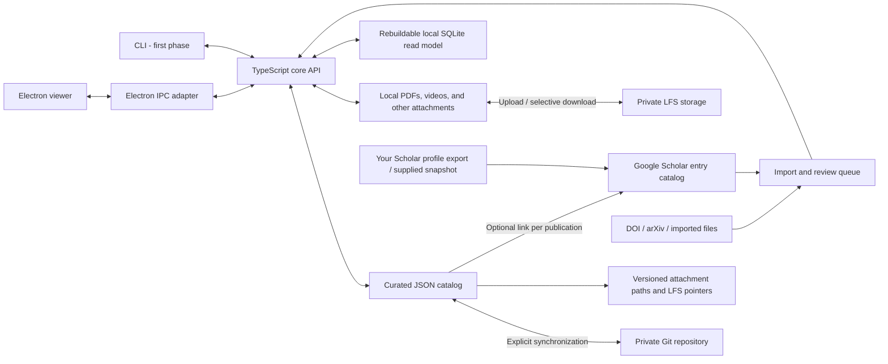

# MyPub — design

The user approved Electron viewer implementation following the [desktop design review](docs/ELECTRON_DESIGN_DRAFT.md). The viewer now implements the light interface, five pages, year/venue navigator, a right-side detail pane, search/combined filters and automatic local-database refresh. The CLI/core and canonical schema version 2 remain compatible. See section 10 for the implemented desktop boundary.

Originally drafted 6 September 2026; implementation updated 7 September 2026. The TypeScript core and `mypub` CLI now use catalog schema version 2. External account and private-remote setup remain user-managed; the Electron viewer is now implemented; desktop editing remains future work. [SCHEMAS.md](SCHEMAS.md) is the authoritative specification of JSON formats and field semantics. This document controls architecture and behavior, with the current implementation boundary below. The codebase has never been used in production and no version-1 catalogs exist, so no v1 migration or compatibility layer is required.

Revised 7 September 2026 with the following user decisions. They are implemented in the version-2 core and CLI:

| Decision | Resulting design |
| --- | --- |
| Detailed matching, including exclusion | Durable entry eligibility/exclusion, pair-specific rejection, reviewed linking/unlinking, and explicit reopening; source refresh does not reset decisions |
| Optional Scholar details | Preserve source publication date, volume, issue, pages, publisher, patent fields, description, and source/cited-by URLs |
| Literal Scholar authors and completeness | `authors_text` plus `authors_completeness` alongside the ordered source `authors` array |
| Scholar-only citations, updateable or null | Dated citation samples contain a number or `null`; the latest observation determines the current count |
| Record-level metadata time | Keep `updated_at` per record; no per-field timestamps. Citations retain their own observation times |
| No publication status | Omit lifecycle status; optional `archived_at` retains catalog archive/restore behavior |
| Admit duplicate arXiv IDs | Save all publication UUIDs and report duplicate IDs as audit errors, without rejecting writes or synchronization |
| Main publication date with optional lifecycle dates | Top-level `publication_date` is normally sufficient; `submission_date`, `acceptance_date`, `online_date`, and `issued_date` are optional, preserving supplied precision |
| Git-based user identity and audit attribution | Use the catalog repository's actual Git committer identity; no separate application users or duplicated actor fields |

Build a reusable TypeScript core and a command-line interface over a portable, versioned publication catalog. Provide an Electron viewer over the same local catalog. Store curated metadata as one readable JSON file per publication and synchronize through a private Git repository. Store publication PDFs and other attachments under the same repository layout using Git LFS, with selective downloads on each computer. Use external sources to propose metadata changes and refresh a local mirror of your Google Scholar profile and its dated citation counts. Your accepted records remain authoritative. Publications are the only publication-level bibliographic entity; optional relations connect related publications without a parent “Work” layer. Shared author records identify people, while each publication stores their ordered credits, publication-specific names, and authorship roles. Shared venue records identify journals, conference/workshop series, and repositories; publications link to them while preserving their own bibliographic venue wording.

The core runs locally through a CLI, an importable TypeScript API and the Electron viewer. The viewer uses the same catalog read/validation operations from a background worker. A hosted browser interface, HTTP server and embedded attachment previews remain deferred; the core has no dependency on Electron or a UI framework.

## 1. Scope and chosen direction

The system manages your own publication history: searchable records, publication relations, PDFs, videos and other attachments, BibTeX exports, citation snapshots, and a queue of discrepancies to review. Several hundred or a few thousand records should fit comfortably in a simple local application; no distributed database or always-running server is proposed.

The agreed foundation is a Git repository containing one JSON file per publication. The proposed attachment backend is Git LFS: it keeps small pointers in Git and stores the binary content on an LFS server. This gives metadata and attachments a shared version history while allowing the actual files to be downloaded separately. [Git LFS overview](https://git-lfs.com/)

Given your clarification that even videos are usually within 10–20 MB, the recommended backend is a private Git repository with its host's integrated LFS service. GitHub with GitHub LFS is the default hosting recommendation. Use one repository and the associated LFS endpoint, with no separately administered object store or attachment repository. The aggregate collection and retained binary versions, rather than individual file sizes, determine storage needs.

## 2. Architecture and ownership



Each computer keeps a complete metadata replica. The private repository's main branch is the shared accepted history. Local edits are durable immediately but visibly marked as pending synchronization until pushed. Offline computers can temporarily disagree; the application must never imply that an unsynchronized edit is already available elsewhere.

Separate four kinds of information:

- **Curated records:** accepted titles, authors, venues, dates, identifiers, tags, links, and notes.
- **External reference and review records:** a local Google Scholar profile mirror with entry metadata and citation history; import evidence and decisions retained in review records. DOI/arXiv lookups propose enrichment without creating a generic external-entity catalog.
- **Managed attachments:** original PDFs, videos, slides, and supplementary files. The publication JSON describes them; LFS stores their bytes.
- **Derived files:** search indexes, generated BibTeX, CSV, and HTML. These can be rebuilt and are never edited as a second master copy.

### 2.1. Private catalog repository folder plan

The MyPub application codebase and each private catalog repository are separate, as confirmed. This folder plan covers the private data repository only. The application is installed once and opens a chosen catalog root; updating application code does not alter a library's Git history. Each library has its own `catalog/library.json` identity and Git remote. This retains one repository for all metadata and attachments of a library, without requiring separate repositories for authors, venues, or binaries. The layout below is proposed; this design review does not create directories or move existing files.

The private catalog repository has this layout:

```text
my-publications/                         # Private catalog repository root
├── .git/                                # Managed by Git; includes local LFS objects
├── .gitattributes                       # Track attachments/** with Git LFS
├── .gitignore                           # Ignore local/
├── README.md                            # Short catalog layout / restore instructions
├── catalog/                             # Shared JSON in ordinary Git
│   ├── library.json                     # Library UUID and catalog schema version
│   ├── publications/
│   │   ├── 2026/
│   │   │   └── an_example_paper_b6f75c51.json
│   │   └── unknown_year/               # Publication year not established
│   ├── authors/
│   │   ├── d/
│   │   │   └── doe_jane_quinn_9b4fce15.json
│   │   ├── w/
│   │   │   ├── wang_wei_6a1f9d77.json
│   │   │   └── wang_wei_455cbd95.json
│   │   └── unknown_surname/            # Family name not established
│   ├── venues/
│   │   └── journal_of_example_research_cbf1272a.json
│   ├── gscholar/
│   │   ├── profile.json                 # Your mirrored profile and capture coverage
│   │   └── entries/
│   │       ├── 2026/
│   │       │   └── an_example_paper_593de6b0.json
│   │       └── unknown_year/           # Scholar year not observed
│   ├── reviews/
│   │   └── import_google_scholar_2026_09_06_74c6a5ce.json
│   └── config/
│       └── author.json                 # Shared self_author_id; no duplicate author details
├── attachments/                         # Tracked LFS pointers; files when downloaded
│   └── <publication-uuid>/
│       ├── <attachment-uuid>/paper.pdf
│       ├── <attachment-uuid>/supplement.pdf
│       └── <attachment-uuid>/presentation.mp4
└── local/                               # Machine-local; entirely ignored by Git
    ├── settings.json                    # Device preferences and offline pins
    ├── sync.json                        # Last successful synchronization state
    ├── write.lock                       # Serializes catalog mutations
    ├── conflicts/
    │   └── <conflict-uuid>.json          # Unresolved synchronization alternatives
    ├── transactions/
    │   └── <transaction-uuid>/          # Recoverable staged multi-record writes
    ├── index.sqlite                     # Rebuildable integrated database; never tracked
    └── exports/                         # Generated JSON, BibTeX, CSV, etc.
```

The attachment UUID placeholders represent distinct attachments. For several hundred publications/Scholar entries and over a thousand coauthors, partition publications and Scholar entries by year, and authors by surname initial. Keep one JSON file per entity. Venues and reviews remain flat; create year/initial directories only when they contain records. Readable filenames follow the rules below. Attachment directories continue to use full UUIDs so renaming publication metadata does not move binary files or change LFS paths.

#### Readable filenames and stable identities

Use **`<snake_case_name_or_title>_<uuid_prefix>.json`** for catalog entity and review files. The default prefix is the first eight hexadecimal characters of the record's lowercase UUID. Keep the complete UUID in the JSON `id` and in every reference; a filename or eight-character prefix is never a foreign key.

| Collection | Group and filename stem | Example relative path |
| --- | --- | --- |
| `publications/` | Bibliographic year; publication `title` | `2026/an_example_paper_b6f75c51.json` |
| `authors/` | Surname initial; family name, given names, suffix | `d/doe_jane_quinn_9b4fce15.json` |
| `venues/` | Venue `preferred_name` | `journal_of_example_research_cbf1272a.json` |
| `gscholar/entries/` | Last observed source year; entry `title` | `2026/an_example_paper_593de6b0.json` |
| `reviews/` | A stored, readable `summary`, such as “Import Google Scholar 2026-09-06” | `import_google_scholar_2026_09_06_74c6a5ce.json` |

Derive a publication's year from `publication_date`, falling back to `issued_date`, then `online_date`. For an arXiv preprint without those dates, use the year of its original `submission_date`; a later revision does not change that year. If no applicable bibliographic date is known, use `unknown_year/`. Do not substitute import/creation time, acceptance year, or `venue.event_year`. Use the same definition for the default publication-year filter and show which date supplies it. Scholar entries use their own last observed `year`, or `unknown_year/` if it has never been supplied. A linked publication and Scholar entry may therefore live in different year directories without breaking their association or hiding a year discrepancy. Valid known years use four-digit directory names.

Store optional identity-level `name_parts` with `family`, `given`, and `suffix` on author records. `family` is the full reviewed surname, including compound names or particles; `given` includes middle names. Build the filename stem in that order, omitting absent parts: Jane Quinn Doe becomes `doe_jane_quinn`, and a supplied family name “de la Cruz” groups under `d/`. These identity fields describe the preferred name; publication-level name parts still describe each paper's actual credit. `preferred_name` remains the natural display name and is not rewritten into surname-first order merely for filing.

Use the first letter of the reviewed family name for the author directory, lowercased. For the directory initial only, decompose Unicode and remove combining accents so an accented Latin initial groups with its base letter (for example, É → `e/`). Preserve a non-Latin initial as a Unicode directory name; do not invent transliterations. Known family names whose normalized initial is not a letter use `_other/`. If family-name information is absent or uncertain, use `unknown_surname/` and temporarily derive the filename from the unchanged `preferred_name`. Do not guess the surname by taking the last token. Imported structured names can propose identity name parts for review; mononyms may be explicitly supplied as the filing family name. If only a family name is established, its stem plus the UUID is sufficient. Learning or correcting the family name moves the record into the appropriate directory and gives it a surname-first filename.

Apply one deterministic slug rule: Unicode NFKC normalization and locale-independent lowercase; retain Unicode letters, digits, and attached combining marks; replace runs of punctuation, whitespace, and other characters with one underscore; then trim leading/trailing underscores. Preserve non-Latin names instead of requiring transliteration. Limit the stem to 120 UTF-8 bytes without splitting a character, trim trailing separators/marks left by truncation, and use the collection's singular entity name if the stem would be empty. Reserve the UUID suffix and `.json` outside that limit. This is a filename transformation only: the original Unicode name/title in JSON remains untouched. Filename examples are illustrative, not additional sample records to create.

Eight characters are a readability aid, not a uniqueness guarantee. Detect destination-path collisions using case-insensitive, Unicode-normalized comparison for portability; the year/initial directory is part of that comparison. If distinct full UUIDs produce the same filename, extend the suffix for all records in that collision group to 12, then 16, then all 32 hexadecimal UUID characters as needed. Never overwrite an existing record, invent a different UUID to fix its filename, or use order-dependent `_2` counters. Check the entire proposed collection before writing, including moves between year/initial directories and concurrent additions during synchronization. Duplicate full UUIDs are an identity conflict, not a filename collision to fix by extending the suffix.

When an accepted edit changes a title, venue name, author name parts, review summary, or applicable year enough to change its destination path, move/rename its JSON file in the same recoverable transaction as the content edit. An author preferred-name edit must also reconcile its structured parts or explicitly leave them unresolved, so filenames do not silently use stale surname/given-name data. Scholar title/year refreshes follow the same rule. A move removes the old path only when the new record is safely staged; it never leaves two active copies of one ID. Changing a citation/author/venue key alone does not rename the file because those keys are not the source of the stem. Archive or merge status alone does not rename records; tombstones stay in their collection with their last readable name. Binary paths and UUID links remain unchanged. This keeps the directory overview aligned with current names while Git records filename changes.

Resolve references by recursively scanning each collection's record JSON `id` values across all year/initial directories  and rebuilding an ID-to-path index locally; never reconstruct a path from a UUID alone or persist a second authoritative path manifest. Hand-edited names and manually renamed files remain discoverable by full ID. Validation reports a filename or year/initial directory that no longer follows the rule and offers an explicit repair, rather than treating the filename as a new entity. A duplicate record ID in two files is an error that must be resolved before the catalog becomes active.

Synchronization must align base/local/remote records by full UUID before comparing paths or fields. Two offline edits can move or rename the same entity differently, and two distinct additions can collide on a short filename. Preserve these records and their alternatives in the temporary reconciliation workspace, resolve content conflicts, then calculate collision-free destination directories and filenames for the combined catalog. A path-only rename is not an entity deletion followed by creation. Do not depend solely on Git's filename-based merge to preserve identity.

Fixed files (`library.json`, `gscholar/profile.json`, and configuration files) retain their descriptive names. Machine-local conflicts and transactions retain UUID-based paths because they are operational state. New catalogs use version 2 directly; unsupported versions are rejected before mutation. Unknown dates or unresolved surnames use their fallback directories without blocking admission.


Keep relationship ownership explicit:

| Information | Canonical location |
| --- | --- |
| Publication → author, printed name, order, roles | Publication's ordered `authors` array |
| Publication → venue, bibliographic wording, event year | Publication's `venue` object |
| Publication → Google Scholar entry (zero or one) | Publication's optional scalar `gscholar_entry_id` |
| Publication → related publication | Source publication's `relations` array |
| Attachment identity, description, path, hash | Publication's `attachments` array |
| Author's / venue's / Scholar entry's publications, incoming relations | Derived from publication records; indexed locally |
| Identity aliases and merge redirects | Corresponding author or venue record |
| Scholar entry metadata, citation history, and profile coverage | `gscholar/` |
| Import evidence and acceptance/rejection of suggested changes | `reviews/` |

There is no separate authoritative authorship table, relationship directory, or editable aggregate `authors.json`/`venues.json`. Derived SQLite tables may represent these associations for querying. Keeping names alongside references makes individual publication files useful to a reader, while shared identities avoid duplicating profile IDs and preferred names. Bibliographic JSON never embeds machine-specific absolute paths.

`gscholar/` mirrors entries from your one selected Google Scholar profile; section 6 defines the association and refresh rules. It replaces the proposed generic `observations/` directory. Reviews remain library-wide because one import or identity correction can affect several entities. A review has a readable `summary` for display and filename generation and identifies its target entity kind and UUID where applicable. Review state changes do not automatically change that summary. An import review retains immutable source evidence (provider, capture time, source reference, original payload, completeness, parser version, and input fingerprint) alongside proposed changes and their decisions. Batch reviews may contain several targets or no changes, allowing original imports to be retained even when no update is needed. Repeated identical imports reuse that evidence. Other reviews may reference an existing import review; do not rely solely on a temporary input path. DOI/arXiv enrichment uses this evidence and accepted publication identifiers without adding another top-level source catalog.

Application-wide preferences for the current OS user live outside the repositories in `~/.config/mypub/config.json`. The implemented `repo_path` option selects the default catalog. CLI `--root` takes precedence; without either setting the CLI uses its working directory. `mypub config show` displays stored preferences and the effective path. Configuration is read without creating files and validated before catalog access; explicit `--root` and help remain usable with a broken config. The core `Catalog` API continues to require an explicit root and never consults user preferences implicitly. See SCHEMAS.md section 10.1 for the format and path rules. Future application-wide options belong here; Git identity continues to follow Git configuration.

`catalog/config/` contains shared library choices only. Venue identities live in `catalog/venues/`; the owner config points to `catalog/authors/`. Runtime schemas belong to the application repository rather than independently editable copies inside each library.

All of `catalog/`, including review evidence and the Scholar mirror, travels in ordinary Git; attachment content travels through LFS. Generated exports and indexes stay local. `local/` being ignored does **not** make all its contents disposable: unresolved conflicts, pending transactions, and device settings must survive restarts. Cleanup may remove rebuildable indexes or replaceable exports, but must preserve unfinished work. Completed transaction staging can be removed after recovery is no longer needed. Independent backups belong outside this repository; do not place them under `local/` or recursively include them in the catalog backup.

JSON is the canonical format because it has straightforward validation and predictable serialization. [SCHEMAS.md](SCHEMAS.md) defines every canonical and operational JSON record, nested field, representation rule, and catalog-wide constraint. The CLI and typed API handle normal editing initially; Electron will provide forms later. Hand-edited JSON is validated before imports, exports, or synchronization use it. BibTeX is an import/export format: it is less suitable for relationships, provenance, and citation history. Schema versions and explicit migrations keep future changes recoverable.

### 2.2. User identity and audit attribution

Use the underlying Git repository's identity and history for user attribution. There is no MyPub user catalog, login, password, application role table, or separate user-to-committer mapping. Repository access follows the existing filesystem and Git host permissions. Publication author identities, including `config/author.json`'s `self_author_id`, describe bibliographic people and the selected Scholar profile; they are not application accounts and must not determine the Git identity.

When MyPub commits in a catalog repository, let Git resolve its effective committer through the normal repository/global configuration and process environment. Do not replace it with a hard-coded MyPub identity, infer it from the library owner, or modify Git identity configuration automatically. If Git cannot resolve an identity or refuses the commit, report that failure and preserve the local work. The current commit adapter already invokes ordinary Git without overriding identity; the history presentation described here remains planned.

An audit event identifies the commit by its full object ID and reads the **committer name, email, and commit time from that commit object**. Git author metadata may differ and can be shown separately, but the audit actor is the committer. Read historical identity from history, not today's Git configuration. A merge commit is attributed to its committer; existing parent commits retain their own attribution. Do not rewrite historical identities when configuration changes.

Reviews retain what was proposed, accepted, rejected, or excluded, the reason, evidence, and decision time. Git supplies who committed that change. Do not add independent `created_by`, `updated_by`, `decided_by`, or application user-ID fields to canonical records. Audit/history queries follow full record UUIDs across readable filename changes and inspect the commit introducing the relevant record or decision transition; a later unrelated edit to the review does not become the original decision's attribution. A commit can record a batch, and its committer is the recorded committer for that batch, without asserting who physically made every prior working-tree edit.

Locally saved changes without a commit remain visibly uncommitted, with no fabricated historical committer. Record `updated_at`, review `decided_at`, and citation `observed_at` keep their existing meanings and need not equal Git commit time. Once committed, they are attributable through that commit even before it is pushed. This preserves the distinction between saved, committed, and synchronized work.

Git history is the authoritative attribution store, not another JSON audit-log collection. Any history index is rebuildable from retained commits. A full clone or backup including Git history carries this attribution; native JSON interchange carries records and review evidence, not the source repository's commit history. Importing such JSON creates new commits under the importing committer and must not pretend to reconstruct unavailable original Git actors. Legacy source actor labels/IDs may remain inside clearly identified imported evidence, without becoming Git identities or new MyPub accounts. Data-quality auditing (for example duplicate arXiv IDs) remains distinct from this change history.

### 2.3. Integrated local database

Implemented in the TypeScript core and CLI: use SQLite as the integrated read model for fast retrieval and multiple views. The validated JSON catalog remains the source of truth. Derive publications, authors, ordered credits, venues, relations, Scholar entries and citation observations, reviews, and attachment metadata into local tables. SQL queries/views can support publication lists, author bibliographies, venue/year summaries, citation trends, and review queues. All accepted edits go through the core's validated, recoverable JSON transactions before refreshing the database; no accepted information exists only in SQLite.

Store the database at `local/index.sqlite`. **The local database must never be managed by Git or Git LFS.** Ignore the entire root `local/` directory, including SQLite WAL, shared-memory, journal, and temporary rebuild files. Catalog initialization must preserve existing ignore rules while ensuring this exclusion. Synchronization must not stage or publish these files. Each computer rebuilds its own database from its local catalog; cloning/restoring a catalog does not require a database copy.

**Refresh automatically whenever relevant source data changes; users must not need to run `mypub index rebuild` for normal operation.** Trigger refresh centrally after successful catalog transactions, covering edits, imports, review decisions, identity merges, Scholar/citation updates, and attachment-manifest changes, as well as successful synchronization integration, restore, and transaction recovery. Saved but uncommitted records belong in the current view. Fetching remote commits alone does not change the active catalog and therefore does not activate remote data in SQLite.

Check source freshness automatically when opening the catalog and before database-backed queries; detect external JSON additions, edits, deletions, and renames, as well as Git checkout/reset/pull changes. A commit ID alone cannot detect uncommitted edits. Refresh a stale database before serving results. The CLI detects external changes on its next relevant operation; the long-running Electron viewer also watches for changes and refresh its active views, with freshness checks remaining the correctness backstop. Exclude `local/` outputs from source-change detection to avoid refresh loops. Invalid external changes must produce a validation error rather than silently presenting an older snapshot as current.

Initially rebuild the complete database after changes. Build from a consistent validated catalog snapshot and publish the refresh atomically so queries never see a partial rebuild. Track an internal database schema version and source fingerprint independently of catalog schema version 2. If refresh fails, preserve the saved JSON, report stale cache state, and automatically retry on the next relevant operation or use canonical reads instead of silently returning outdated results. Automatically rebuild missing, incompatible, or corrupt databases. Keep `mypub index rebuild` as an explicit diagnostic/repair command. Introduce incremental refresh only if measurements justify its complexity. Database constraints must preserve canonical semantics, including non-unique arXiv identifiers.

Acceptance checks verify automatic freshness after local transactions, sync integration, restore/recovery, and external file/Git changes without a manual rebuild; automatic recreation after cache deletion; complete snapshots under concurrent reads/writes; and preservation of saved records with explicit stale/error reporting after a failed refresh. SQLite and all sidecar/rebuild files must remain untracked throughout.

The implementation stores complete canonical records in a `records` table with their actual paths and full JSON, alongside indexed tables for publication metadata, identities, credits, identifiers, tags, relations, attachments, Scholar entries/observations/captures, reviews, proposals, and review targets. Optional fields without dedicated columns remain queryable through SQLite JSON functions. The internal database format starts at version 1, independently of catalog schema version 2. SQL views expose `author_bibliography`, `venue_year_summary`, and `review_queue`. Citation observations are keyed by Scholar entry so shared links need not double-count them.

Before reads, content/path hashing checks the catalog source; unchanged files avoid repeated JSON parsing and schema validation, while changed files require a validated snapshot and a complete rebuild. This intentionally still reads the catalog bytes on each operation to detect external edits reliably. All application reads and rebuilds share the catalog write lock; a concurrent operation reports `CATALOG_LOCKED` for retry. A new SQLite file is built transactionally under `local/` and atomically replaces the old file. No persistent writable database connections are exposed. `CACHE_STALE` after a saved transaction explicitly reports `saved: true`; the caller should retry a read/rebuild rather than repeat the edit. Invalid canonical data remains a validation error. Synchronization refuses locally tracked or incoming tracked `local/` files rather than silently deleting or publishing them.

## 3. Publications and optional relations

Each record represents one publication: an arXiv preprint, conference paper, workshop paper, or journal article. Related publications remain separate records, each with its own bibliographic metadata. There is no Work entity, edition hierarchy, or required grouping step.

| Object | Essential fields |
| --- | --- |
| Publication | Stable UUID, stable citation key, type, title, ordered authors, venue, dates, DOI/arXiv ID, volume/issue/pages or article number, URLs, tags, notes, optional relations, attachments, optional primary attachment ID, optional archive timestamp |
| Author | Stable UUID, readable author key, preferred name, optional structured name parts, aliases, identifiers, disambiguation note, archive/merge state |
| Author credit | Name as credited, optional linked author UUID, optional structured name and roles; embedded in the ordered publication authors array |
| Venue | Stable UUID, readable venue key, kind, preferred name, optional abbreviation, aliases, URLs, notes, archive/merge state |
| Publication venue | Bibliographic venue name, optional linked venue UUID, optional event year; embedded in the publication |
| Relation | Type, target publication UUID, optional note; stored on the source publication |
| Google Scholar entry | Local stable UUID, profile ID, external entry ID, source names/text/completeness, optional bibliographic details, matching policy, citation history, presence state, record update time |
| Scholar profile mirror | Selected profile ID, dated capture coverage, optional profile-level totals |
| Review/import evidence | Typed entity targets, immutable source payload and capture metadata, proposed changes, review state and decisions |
| Attachment | Stable ID, role, label, original filename, MIME type, byte size, storage backend, repository-relative path, SHA-256, optional source URL; embedded in its publication JSON |

Keep the author order and full supplied names; preserve Unicode and bibliographic capitalization. Keep preprint submission, acceptance, online publication, and issue dates distinct. Use a stable citation key that does not automatically change when the title or venue changes.

Most publications need only a top-level `publication_date`. It accepts a year (`"2024"`), year/month (`"2024-06"`), or full date (`"2024-06-18"`) according to what is known. Optional top-level `submission_date`, `acceptance_date`, `online_date`, and `issued_date` retain more specific lifecycle facts when available. A generic date does not assert one of those lifecycle meanings. Omit unknown values rather than inventing a month/day or copying the generic value into every date field. The version-2 format has no nested `dates` object and no separate publication `year`; section 2.1 defines year derivation for filing and filters.

For journal papers, the curated `publication_date` is the journal issue publication date, preserving its known precision. Store online-first publication separately in `online_date`; it does not replace the issue date. An unknown issue date remains unknown until verified. Review source dates before accepting them as issue dates, and retain Scholar’s literal source year even when it differs from the curated issue year. Thus the TPAMI paper “Temporal Segment Networks for Action Recognition in Videos” is counted in 2019 by issue publication, not in its 2018 online-first year.

Publications have no lifecycle `status` field or status filter. Catalog archiving is represented solely by optional `archived_at`; restore removes it. Active in the catalog does not mean formally published. Metadata uses one `updated_at` per record, without per-field timestamps; source evidence remains in reviews, and citation observations keep their own dates.

Start with three relation types:

| Relation | Direction and example |
| --- | --- |
| `published_version_of` | Conference or journal publication → its earlier arXiv preprint |
| `extends` | Extended journal article → earlier conference or workshop publication |
| `related_to` | General association between publications when a more specific relation is unsuitable |

For example, the conference publication record contains:

```json
{
  "id": "conference-publication-uuid",
  "type": "conference",
  "relations": [
    {
      "type": "published_version_of",
      "target_id": "arxiv-publication-uuid"
    }
  ]
}
```

This is an illustrative excerpt; the complete record also contains its bibliographic fields. Store each relation once. Derive incoming links so publication details expose “Preprint” and “Published version” labels without maintaining duplicate relation entries. Expose `related_to` in both directions. The CLI prints these relations; the later Electron UI renders them as links. Relations are optional, may connect multiple records, and do not merge metadata or automatically imply further relations.

An arXiv base ID identifies a preprint record; retain version suffixes as revision metadata without requiring a separate publication for every arXiv revision. Every publication has a local UUID so records without external identifiers remain manageable. Distinguish a publication's own identifiers from identifiers mentioned by an external source as related publications: a conference DOI supplied in arXiv metadata is evidence for a relation, not a reason to merge the records.

Several publication UUIDs may retain the same normalized arXiv ID. Admit them to the catalog and report the duplicate as an auditing error with all affected UUIDs; do not reject the import, discard an identifier, or merge records automatically. Auditing resolves whether the source has duplicate records, a mistaken ID, or an ID that belongs to a related preprint. arXiv lookup must return all matches and require disambiguation before attaching new evidence or making a new link. DOI uniqueness remains a blocking constraint. Section 9 and SCHEMAS.md section 16 distinguish audit findings from admission checks.

Library listings show one row per publication, and exports contain the selected publication records. Counts reflect the selected records, with filters such as “exclude preprints” or “journals and conferences.” Relations do not change those counts. Title similarity only suggests duplicates or related publications for review; it never collapses them automatically.

### 3.1. Author management

**The current design is insufficient for author identity and roles.** Its implemented `Author` value contains only `name` and optional `orcid`, embedded separately in every publication. The existing `config/author.json` describes only the library owner's name variants and profiles. Neither establishes shared author identities, publication–author associations, or publication-specific roles. Matching by name would conflate different people and miss variants of the same person.

Introduce two distinct concepts:

| Concept | Owns | Does not control |
| --- | --- | --- |
| Author identity | Preferred display name, optional known aliases, external profile IDs, disambiguation note | How a name was printed on a particular publication, author order, or roles on that publication |
| Publication author credit | Name as credited, optional link to the author identity, and roles on this publication | The person's preferred name or roles on other publications |

The ordered `authors` array in a publication is the canonical association list. One author can link to many publications, and each publication can link to many authors. Derive an author's publication list from these links; do not also maintain publication IDs in author records. Preprints and published versions keep independent author lists and roles, even when related.

#### Identity and readable JSON

Give each author a random, immutable UUID, independent of their name and external profiles. An optional Scholar profile or ORCID helps identify a person but is not the catalog's primary key. A person without either identifier is fully supported. Equal names and overlapping aliases are allowed on distinct author records.

Store one author per `catalog/authors/<surname_initial>/<surname_first_stem>_<uuid8>.json`. A required, unique `author_key` provides a readable CLI handle, such as `jane-q-doe` or `wei-wang-vision`; it is chosen at creation and stays stable when the preferred name changes. It may be explicitly renamed after a uniqueness check. Names, affiliations, and profile IDs must never generate automatic identity changes. References in publications always use the UUID, so changing a key does not rewrite publications. Disambiguation notes help a human distinguish people and need not be globally unique.

Illustrative author record (timestamps and other lifecycle fields omitted):

```json
{
  "schema_version": 2,
  "id": "9b4fce15-a27c-4dca-9c73-84ca1c74b5e2",
  "author_key": "jane-q-doe",
  "preferred_name": "Jane Quinn Doe",
  "name_parts": {
    "family": "Doe",
    "given": "Jane Quinn"
  },
  "aliases": ["Jane Q. Doe", "Jane Doe"],
  "identifiers": {
    "google_scholar": "exampleProfileId"
  },
  "disambiguation_note": "Computer vision researcher; formerly at Example University"
}
```

`identifiers` is required and may be empty (`{}`). Initially support optional `google_scholar` and `orcid` values. Scholar values are the opaque, case-preserved `user` parameter of a profile URL, not the entire URL or a Scholar article ID. Accept a profile URL as input and extract that parameter, discarding language and tracking parameters. Google documents this profile URL structure. [Google Scholar profile links](https://scholar.google.com/intl/en/scholar/citations.html)

A confirmed `(provider, identifier)` belongs to at most one retained author identity in a library. If it is claimed by another record, require identity review rather than merging silently. Normalize ORCID URL and bare-ID inputs to the same value; validate format without claiming that syntax proves ownership. Keep previous or additional confirmed profile IDs in optional `identifier_aliases` entries with `provider`, `value`, and an optional note; apply the same uniqueness rule to those entries. This supports corrected or multiple profiles without changing the local UUID. An identifier mistakenly assigned to a person must be removed or reassigned through review, not retained as their alias. Evidence and past assignments remain in review records and Git history.

The example profile ID is fictional. No profile lookup or network connection is required to create or use an author record.

Complete illustrative publication JSON under the version-2 schema (fictional metadata; the referenced author, venue, and Scholar entry records would also exist in the catalog):

```json
{
  "schema_version": 2,
  "id": "b6f75c51-98f3-4e9c-af55-16dafb11a7cb",
  "citation_key": "Doe2026Example",
  "gscholar_entry_id": "593de6b0-af11-42e2-9062-c742bf154ad5",
  "type": "journal",
  "title": "An Example Paper",
  "authors": [
    {
      "name": "Jane Q. Doe",
      "author_id": "9b4fce15-a27c-4dca-9c73-84ca1c74b5e2",
      "roles": [
        "co_first",
        "corresponding"
      ]
    },
    {
      "name": "Alex Chen",
      "author_id": "3412caa5-f3e1-4e66-8e56-7cd2ab6e3479",
      "roles": [
        "co_first"
      ]
    },
    {
      "name": "Wei Wang",
      "author_id": "6a1f9d77-104e-4d8a-bf71-23f976e78a21"
    },
    {
      "name": "Wei Wang",
      "author_id": "455cbd95-52bf-4df1-8e45-17d1e3f087c6",
      "roles": [
        "corresponding"
      ]
    }
  ],
  "authorship_note": "Jane Q. Doe and Alex Chen share first authorship. Jane Q. Doe and the fourth author are corresponding authors.",
  "venue": {
    "name": "Journal of Example Research",
    "venue_id": "cbf1272a-2268-452a-961c-78c6a783820f"
  },
  "publication_date": "2026-08-15",
  "identifiers": {},
  "extra_urls": [],
  "tags": [
    "computer-vision"
  ],
  "relations": [],
  "attachments": [],
  "created_at": "2026-09-06T08:00:00Z",
  "updated_at": "2026-09-06T08:00:00Z"
}
```

The two Wei Wangs are different people despite identical printed names. Their separate author records can provide distinct keys, notes, and optional profiles. An unresolved credit would instead contain only its `name` and any known roles or note, omitting `author_id`.

A second publication may contain this credit for the same Jane:

```json
{
  "name": "Jane Doe",
  "author_id": "9b4fce15-a27c-4dca-9c73-84ca1c74b5e2"
}
```

These examples deliberately keep `name` beside the link. It is authoritative bibliographic text, not a cache of `preferred_name`. Opening a publication JSON therefore reveals its authors and roles without following UUIDs. Renaming an author identity never changes past publication names or exports. Do not duplicate `author_key`, preferred name, profile IDs, or whole author records in each credit. Two different people may both have `name: "Wei Wang"`; distinct `author_id` values distinguish them, and detail views resolve their keys and notes on demand.

Preserve Unicode, punctuation, initials, and name order. Optional credit-level `name_parts` (`given`, `family`, `suffix`) can support reliable citation formatting when supplied or reviewed; do not require every name to fit Western given/family conventions. Keep literal names usable without parsing them. A consortium or group name can remain a literal unlinked credit; a separate organization model is deferred.

Serialize UTF-8 JSON with two-space indentation, consistent field ordering, and a trailing newline. Put `name` first in each credit, followed by its link and roles. Preserve author-array order. Omit absent optional fields and keep source evidence payloads in reviews rather than filling publication records with matching scores. Readable filenames use the naming and collision rules in section 2.1; full UUIDs preserve identity across filename changes.

#### Order and authorship roles

Roles belong to a credit, never globally to an author. Keep author order in the array alone; do not duplicate a numeric position. Distinguish literal position from an explicit authorship designation:

| Meaning | Representation and behavior |
| --- | --- |
| First-listed / last-listed author | Derived from array position; display as position, without inferring contribution, seniority, or correspondence |
| Joint first authorship | `co_first` on every credited joint first author, including the first-listed one |
| Corresponding author | `corresponding`; multiple authors may carry it, and it can coexist with `co_first` |
| Joint last authorship | Optional `co_last` on each explicitly credited joint last author |
| Equal contribution without a first/last designation | `equal_contributor`; do not turn a generic equal-contribution statement into joint first authorship |
| Other source-specific wording | Optional credit `note`; add further controlled roles through a later schema revision |

Use the conventional label “corresponding author” in displays. A “first authors” query is explicitly defined as first-listed plus any `co_first` credits; also expose a separate first-listed-only filter. Such a query reflects bibliographic position and recorded designations, not a judgment about contribution in alphabetical author lists. There is no stored `first` or `last` role that could become inconsistent after reordering.

Omitted or empty `roles` means no special role recorded, not verified absence. Never infer correspondence from last position, or co-first authorship from name order alone. Roles require supplied evidence or a manual assertion. Preserve the source statement and its reference in the review evidence history; a publication-level `authorship_note` may retain a useful readable statement. If there are multiple distinct equal-contribution groups, use an optional `equal_contribution_group` on the relevant credits; its label is local to that publication and does not imply a first/last role. A missing group leaves the grouping unspecified.

Keep supported authorship annotations separate from clean author names and structured name suffixes, retaining original marked text in review evidence. Roles belong to publication credits and do not become global author properties.

Validate known roles and reject repeated role values. A singleton co-first/co-last designation or equal-contribution group warrants a warning for review; partial source lists may explain it. Roles remain valid on unresolved credits. Unsupported or contradictory source statements are review items, never silently normalized into stronger claims. Detailed contribution taxonomies and affiliation histories are outside this revision.

#### Linking, ambiguity, and correction

A credit's `author_id` is optional: its absence means unresolved identity. This allows a usable bibliography without requiring the user to identify every coauthor immediately. Once linked, the UUID must resolve to an author record through the ID-to-path index. Candidate links and their confidence stay in the review queue, not in the accepted association field.

Resolve identity using this order:

1. Preserve a previously accepted credit link unless the user accepts a correction. When refreshing a changed list, do not transfer links or roles by array index; realign credits and review ambiguous alignments.
2. An exact author identifier matching a confirmed identity can propose a link. It may be preselected in an import preview if there is no contradictory evidence; applying a new link still belongs to acceptance of that proposal or batch.
3. Preferred names, known aliases, publication history, coauthors, and supplied affiliation context suggest candidates only. Even a unique exact name match in the current library is not proof of identity.
4. The user links to an existing identity, creates a new identity, or leaves the credit unresolved. Do not create one global identity per distinct name automatically.

A Scholar profile's inclusion of a publication supplies evidence, not a definitive link to a same-named credit: Google explicitly notes that profiles can contain other people's articles. Profile ownership and a particular publication credit are separate assertions. [Google Scholar authorship ambiguity](https://scholar.google.com/intl/en/scholar/citations.html)

Observed spellings from confirmed credits are searchable automatically; `aliases` is for additional curated variants and does not need to duplicate every observed spelling. Adding an alias does not retroactively link unresolved same-name credits. Refreshes must preserve accepted identity links, publication spellings, and roles when the source omits them; removal or replacement requires an explicit accepted change. Accepting bibliographic metadata need not require resolving every author.

Provide explicit merge and reassignment operations with previews listing affected publications. A merge selects a surviving UUID, reconciles names and identifiers, redirects accepted links, and retains a tombstone with `merged_into` on the retired author. Resolve redirects for old references, reject cycles, and never discard credit names, order, or roles. If a merge would put the same resolved person in multiple slots of one publication, stop for review rather than dropping or combining credits automatically. An incorrect link can be unlinked or reassigned; splitting a conflated identity creates a new author and moves only selected publication credits and reviewed identifiers. Historical source evidence remains unchanged.

Archive rather than delete referenced authors. Existing credits still resolve, labeled archived; new links to archived identities require explicit restoration. Unresolved credits are validation warnings and appear in a review listing, not catalog errors. Dangling IDs, duplicate author keys, conflicting external identifiers, redirect cycles, and repeated resolved authors within a publication are errors. Duplicate names and overlapping aliases are valid.

### 3.2. Venue catalog

Promote venues from the current publication string and `config/venues.json` alias configuration to shared records in `catalog/venues/<snake_case_name>_<uuid8>.json`. Each venue has an immutable UUID and a required, unique, readable `venue_key`. A publication's optional `venue` object stores its bibliographic `name` and, once resolved, `venue_id`. Derive a venue's publications from those references rather than duplicating publication IDs in the venue record.

Illustrative venue record (fictional metadata; timestamps and lifecycle fields omitted):

```json
{
  "schema_version": 2,
  "id": "cbf1272a-2268-452a-961c-78c6a783820f",
  "venue_key": "journal-example-research",
  "kind": "journal",
  "preferred_name": "Journal of Example Research",
  "abbreviation": "J. Example Res.",
  "aliases": ["JER", "J. Example Research"]
}
```

Required identity fields are `id`, `venue_key`, `kind`, and `preferred_name`, alongside schema version and creation/update timestamps. Initially use kinds `journal`, `conference`, `workshop`, `repository`, and `other`. Aliases and URLs are required arrays and may be empty. Abbreviation and disambiguation notes are optional; names and abbreviations need not be unique. Renaming a preferred name or explicitly changing a key leaves UUID references intact. External venue identifiers can be added later without changing the local identity model.

The same venue may appear on another publication as:

```json
{
  "venue": {
    "name": "J. Example Res.",
    "venue_id": "cbf1272a-2268-452a-961c-78c6a783820f"
  }
}
```

`venue.name` is accepted bibliographic wording for that publication, not a cached copy of the venue's preferred name. Keep it readable in JSON and preserve it in ordinary BibTeX/CSV exports. Catalog views can display the preferred name or abbreviation by resolving `venue_id`; changing these defaults must not rewrite historical publication metadata. A separately requested normalized export may use catalog names, with that choice explicit. Do not copy the venue key, aliases, or complete venue record into each publication.

#### Venue identity and event scope

A venue record identifies a journal or recurring conference/workshop series, rather than each annual event, volume, or issue. Different years of the same conference therefore share a venue ID. Store an optional `venue.event_year` on the publication when a conference/workshop edition needs to be distinguished; it is independent of the publication date. Keep the exact proceedings or event title in `venue.name`. Volume, issue, pages, publisher metadata, and publication dates remain publication-level facts. Dedicated event records, event locations, and an event hierarchy are deferred.

A separately named workshop gets its own venue ID even if colocated with a conference. A proceedings publisher or book series is not automatically the same identity as the conference. A related journal article and conference paper can have different venue IDs, and publication relations never copy venue links automatically. A preprint may link to a repository venue such as arXiv or omit its venue entirely; never assign its later journal venue just because an imported record mentions that journal.

A title variant or reviewed rename of the same continuing venue can become an alias on one identity. Distinct venues with the same acronym remain separate. Do not infer that a successor, split, or merger is the same venue solely from similar names; preserve separate identities unless an explicit identity review establishes continuity. A richer venue-history graph is deferred.

#### Linking, search, and lifecycle

Create or link a venue during publication review, or leave `venue_id` absent while preserving the supplied name. An absent `venue` means no venue recorded; a present name without an ID means unresolved venue identity. Every linked ID must resolve. Imported names and aliases suggest candidates; even an exact acronym or name match is not sufficient to silently merge identities. A missing venue in a refresh must not erase an accepted name or link, and changing the link must not silently replace the publication's wording.

Search includes preferred names, abbreviations, aliases, and publication-specific wording. Exact venue filters use resolved IDs (CLI input may use a venue key), optionally combined with event year. Unresolved text matches remain distinguishable from confirmed membership. Offer list/show/add/update/archive, publication link/unlink, unresolved-venue listing, and reviewed merge operations through the core and CLI. An incorrect association can be reassigned without changing its bibliographic name.

Archive referenced venues instead of deleting them; existing links remain usable and labeled archived. Require restoration before new links to an archived venue. Explicit merges preview affected publications, retain a surviving UUID, reconcile aliases, redirect links, and keep a `merged_into` tombstone. Preserve publication wording and event years. Reject dangling references, duplicate venue keys, and redirect cycles; duplicate names are valid, while unresolved identities and suspicious publication-type/venue-kind combinations are warnings for review. New venue records and the publications linking them must be saved together under the same recoverable catalog transaction.

## 4. Everyday workflows

### Initial migration

Import your current BibTeX/CSV or publication list and a Scholar profile export into a staging area. Preserve the originals. Normalize identifiers, suggest duplicates and publication relations, and enrich records with available metadata. Review uncertain authorship and proposed relations before accepting the batch. Produce a reconciliation summary covering accepted records, unresolved candidates, duplicates, and missing metadata. Reimporting the same file must be idempotent.

### Add a paper

Supply a DOI, arXiv URL, or BibTeX file to the CLI. The core retrieves available metadata and returns a proposal with possible matches. Inspect it, then create a publication or update a confirmed existing record. Optionally link it to an existing publication and select a relation type. Local JSON input supports manual entry offline and papers without identifiers. Adding a conference publication related to a preprint leaves the preprint record intact. Entry forms come with Electron later.

### Find and reuse

Search titles, authors, venues, identifiers, and tags. Filter by year, venue, publication type, tag, or catalog archive state. The CLI prints publication details and related publications, or returns JSON for scripts. Resolve attachment paths and optionally open files or URLs through an operating-system adapter. Export a citation, filtered bibliography, or publication list.

### Audit proceedings

The implemented read-only tools under `proceedings/` search official conference
sources for an exact credited full name, independently of a catalog. Optional
MyPub comparison reports existing conference records, other versions, possible
title variants, duplicate candidates, and metadata differences without importing
them. Adapters cover CVPR, ICCV, ECCV, NeurIPS, ICML, ICLR, AAAI, IJCAI,
SIGGRAPH, ACM Multimedia, CoRL, ACL, EMNLP, NAACL, ICRA, IROS, and RSS. The six latter adapters scan 2020 onward; ACL Anthology tracks remain labeled separately; Findings of the Association for Computational Linguistics (ACL Findings) is a separate venue from ACL, EMNLP and NAACL main conferences, with host and event year retained in each publication, RSS uses official indexes, and ICRA/IROS use an explicit IEEE Crossref fallback excluding journal and workshop records. Source responses are cached with timestamps
and hashes; reports explicitly enumerate scanned coverage and unsupported years.
ICLR acceptance comes from published proceedings or official accepted-paper
programs, never an unfiltered submission search. PMLR colocated workshops are
excluded. ACM's publisher-deposited metadata fallback is labeled as such; SIGGRAPH
Asia, posters, and unverified TOG journal candidates remain distinguishable.
Historical ICCV (2005–2011) and ECCV (2004–2016) searches exhaust publisher-deposited Crossref queries with explicit coverage limits, main-conference filtering, and separate initial-only author candidates. No editions before 2004 are searched by this historical adapter.
The CVPR-specific utility and rendered IEEE companion are retained for older
proceedings. These tools are standalone audit utilities, not a new CLI ingestion
workflow; their schema is an extraction artifact, not a canonical catalog format.

### Manage authors

Create or find an identity by name, author key, or profile ID. Inspect all linked publications with their credited names, order, and roles. From a publication, link or unlink a credit, correct its displayed spelling, or edit its roles without changing the shared identity. From an author, edit the preferred name, add a known alias or profile ID, and preview merges or selected-credit reassignments. `config/author.json` holds `self_author_id`; your aliases and profiles live in that shared identity. Changing this setting does not automatically claim matching credits.

Free-text author searches include preferred names, curated aliases, and linked publication spellings. An exact author filter uses the resolved author UUID, optionally combined with a role filter; it never includes unresolved same-name credits as confirmed matches. Author detail output reports linked publications and unresolved candidates separately. Rebuild the reverse associations and search index from canonical JSON.

BibTeX and ordinary CSV exports keep the credited names and publication order. When structured name parts are available, use them for format-appropriate name encoding; otherwise retain literal-name handling. Common bibliography formats do not reliably round-trip identity links or special roles. Provide native JSON export with the referenced author, venue, and Scholar entry records, the Scholar profile context, and referenced review evidence (including any redirect targets) for lossless interchange, and an optional author-credit CSV (one row per publication credit, with position, credited name, author ID/key, and roles). Do not encode roles by appending asterisks or commentary to names. Importing native JSON must preview UUID, key, and identifier collisions before accepting records into another library.

### Manage venues

Find or create a venue identity, then link it to a publication while keeping the supplied venue wording. Venue details list all linked publications across name variants and event years. Edit catalog names and abbreviations centrally, review unresolved venue candidates, and preview merges. Section 3.2 defines the identity and export rules. Venue configuration is represented by this catalog.

### Attach files

Supply a publication ID, local file path, role, and optional label to the CLI. The core copies the original into its managed attachment directory and records its size and hash. Select a primary PDF for an open-paper operation. Multiple PDFs and videos are supported. Drag-and-drop and embedded previews belong to the later Electron phase.

### Switch computers

Commit saved local changes before running sync when leaving one computer; run sync after moving to the next. The status command distinguishes saved edits awaiting commit, commits awaiting upload, last successful sync, and synchronization conflicts. Automatic sync on launch or after edits can be added with Electron; explicit sync is the initial workflow.

### Review updates

List proposals and inspect field-level discrepancies, with the current value beside the proposed value and its source. CLI/API operations accept, reject, or defer proposals by ID. Remember rejected proposals so unchanged suggestions do not reappear on every refresh. This review mechanism is independent of the later review screen.

## 5. Metadata enrichment and reconciliation

Crossref is the first proposed adapter for publisher-deposited DOI metadata. arXiv supplies preprint metadata and, when present, DOI and journal-reference links. Both have documented programmatic interfaces. A DOI lookup that is unavailable through Crossref falls back to an imported record or manual entry; the design does not assume every DOI is covered. [Crossref REST API](https://www.crossref.org/documentation/retrieve-metadata/rest-api/) · [arXiv API manual](https://info.arxiv.org/help/api/user-manual.html)

Use this publication-matching order (author identity resolution follows section 3.1):

1. Previously confirmed Scholar entry association or an accepted match retained in an import review.
2. Exact normalized primary DOI or arXiv identifier, with checks for contradictory data and identifiers that refer to related publications.
3. Candidate matching from title, author overlap, year, and venue.
4. Manual resolution of ambiguous candidates.

Apply the Scholar matching policies in section 6 before generating candidates. Exact identifiers can attach incoming evidence automatically only when unambiguous; a duplicated arXiv ID must return all candidates for review. New Scholar associations require accepted proposals even when an identifier is unambiguous. Fuzzy matches only propose a link. A one-year date difference or an abbreviated author list should be explained, not silently “corrected.” Imported truncated author lists must not replace complete ordered lists.

During initial import, populate empty fields in the preview. After acceptance, curated values change only through an accepted proposal or your own edit. Preserve original input and change decisions in review evidence and protect manually corrected values from later imports. Do not add per-field timestamps. Missing metadata from a source means “not observed,” not “delete from catalog”; explicit citation checks use the nullable observation rules below.

## 6. Google Scholar profile mirror

Google Scholar is the **only citation source**. Do not add other citation providers or substitute their counts; DOI/arXiv integration is for bibliographic metadata only. Missing Scholar counts remain unknown rather than triggering another provider lookup.

Use `catalog/gscholar/` as a local mirror of **your selected Google Scholar profile**, replacing the generic `observations/` catalog. It contains the external entries as observed, independently of your curated publications. Profile edits remain a separate activity in Scholar. Coauthors' profile IDs in author records identify those people; they do not cause their profiles to be mirrored here.

### Records and associations

`gscholar/profile.json` records the selected `profile_id`, dated capture coverage, and optional dated profile-level totals. The selected ID must belong to the author identified by `config/author.json`'s `self_author_id` and one of that author's confirmed Scholar identifiers. This is a mirror configuration, not a second editable author profile. Switching profiles requires an explicit migration/reconciliation rather than silently mixing two profiles.

Each `gscholar/entries/<year>/<snake_case_title>_<uuid8>.json` represents one entry in that profile. Keep an immutable local UUID for stable references and a separate opaque external `scholar_id`, scoped by `profile_id`. An external ID identifies a profile entry, not the author's profile or a DOI. Enforce uniqueness of the external ID within the selected profile. Readable title-plus-UUID-prefix filenames follow the other entity collections; source title, authors, venue, and year remain readable inside each entry. Source names are literal metadata, without requiring links to curated author or venue identities.

Keep the ordered source `authors` array, optional literal `authors_text`, and required `authors_completeness` (`complete`, `partial`, `unknown`). Completeness describes the retained array. An abbreviated overview may coexist with a complete detail byline; an empty parser result is unknown, not proof of no authors. Ellipses remain text/evidence, never author names. These fields do not claim identity links or overwrite curated publication credits.

Optional source fields are `publication_date`, `volume`, `issue`, `pages`, `publisher`, `patent_office`, `application_number`, `description`, `scholar_url`, and `cited_by_url`. Keep them directly on the entry for readable JSON. The source date is literal text and may be incomplete or malformed; it does not automatically replace the entry's `year` or a curated publication date. Missing metadata in later captures does not erase retained values. Details are source metadata, so patents and other unmatched items can remain in the mirror without a new curated entity type.

A publication stores **zero or one** association as an optional scalar, never an array:

```json
{
  "citation_key": "Doe2026Example",
  "gscholar_entry_id": "593de6b0-af11-42e2-9062-c742bf154ad5"
}
```

The corresponding entry could look like this (fictional IDs and metadata; abbreviated lifecycle fields):

```json
{
  "schema_version": 2,
  "id": "593de6b0-af11-42e2-9062-c742bf154ad5",
  "profile_id": "exampleProfileId",
  "scholar_id": "exampleEntryId",
  "title": "An Example Paper",
  "authors": ["Jane Q. Doe", "Alex Chen", "Wei Wang", "Wei Wang"],
  "authors_text": "JQ Doe, A Chen, W Wang, W Wang",
  "authors_completeness": "complete",
  "venue": "Journal of Example Research",
  "year": 2026,
  "publication_date": "2026/8/15",
  "publisher": "Example Press",
  "matching": {"policy": "eligible"},
  "last_seen_at": "2026-09-06T08:00:00Z",
  "presence": "present",
  "source_review_id": "74c6a5ce-d1b6-4367-a577-997c66d9d86b",
  "citation_history": [
    {
      "observed_at": "2026-09-06T08:00:00Z",
      "count": 12,
      "source_review_id": "74c6a5ce-d1b6-4367-a577-997c66d9d86b"
    }
  ]
}
```

An unlinked Scholar entry is valid and remains in the mirror even if there is no corresponding local publication. Omitting `gscholar_entry_id` means a publication has no confirmed association. Candidate links remain in reviews. Linking a different entry replaces the scalar through an explicit accepted change; never accumulate several active associations.

The reverse direction may still be many-to-one: a preprint and its published version can both point to the same Scholar entry, consistent with the existing design. Derive an entry's linked publications from publication records rather than storing a second list. Shared counts must be labeled and counted once per distinct entry; even the sum across distinct entries is not asserted to equal Scholar's profile total. Google describes how entries and overlapping citations can be merged. [Google Scholar duplicate and citation guidance](https://scholar.google.com/intl/en/scholar/citations.html)

### Matching, exclusion, and rejection

Each entry has `matching: {"policy": "eligible"}` initially. Explicit exclusion sets `policy: "excluded"` with a readable `reason` and `decision_review_id` referring to an accepted policy decision. Keep decision times and reasons in the review; attribution comes from the Git commit recording the decision. Historical source actors may remain in imported evidence only. Exclusion applies to the entire entry, persists through metadata refreshes and synchronization, and prevents candidate suggestions against all publications. The entry remains visible in the mirror and its citation observations can still update; exclusion is independent of presence in Scholar.

Excluded entries cannot have confirmed publication links. Excluding an already linked entry must preview every affected publication and accept the unlinks and policy change together. Restoring eligibility is an explicit reviewed change and does not restore old links. Unlinking alone removes an association without excluding the entry.

Candidate matches live in link/replace proposals targeting a publication's scalar `gscholar_entry_id`. Accepting a match preserves the one-entry-per-publication rule and checks the expected old value and current revision; competing proposals must be reconciled. Never select an arbitrary publication when an identifier has multiple matches.

Rejecting a candidate suppresses that specific publication–entry pair through its retained rejected proposal, while leaving the entry eligible for other publications. It does not reject every UUID in a candidate list. Automatic refresh cannot bypass that rejection by creating another proposal for the same pair. Explicit reopening returns the proposal to pending, removes its terminal decision time, and refreshes its comparison values before a new acceptance. The previous decision survives in Git and original evidence. SCHEMAS.md section 7.3 defines the stored forms and constraints.

### Capture and reconciliation

Use supplied exports and profile-table snapshots. Google documents bibliographic export formats; do not assume those exports contain stable entry IDs or citation counts. Inspect and report available fields. Rows lacking an external ID remain in import reviews until matched to an existing entry or supplemented with an entry ID/URL; do not manufacture a Scholar identity from a title. [Google Scholar profile help](https://scholar.google.com/intl/en/scholar/citations.html)

An accepted capture updates the source mirror and proposes discrepancies against curated publications. Accepting a mirror refresh does not by itself accept publication metadata changes, identity associations, or matching-policy changes. Preserve absent metadata fields as unobserved and retain existing values. Maintain record-level `updated_at`, with no per-field observation times. That time may reflect a citation or policy edit and must not be labeled as proof that every metadata value was refreshed. Original input and provenance remain immutable in the import review. Entries may reference that evidence rather than duplicate raw exports. Reimporting the same capture is idempotent; a later citation check adds a dated sample even when the count is unchanged.

Record each capture's time, `complete`/`partial`/`unknown` coverage, source review ID, and observed entry IDs in `profile.json`. Only a successful complete capture can mark a previously seen entry `missing`; partial, unknown, failed, or older captures cannot establish removal. Missing entries retain their JSON, history, and publication links and are labeled absent from the latest complete capture. A later observation can mark them present again. Entry metadata is the last known source state, with Git retaining prior versions; `citation_history` explicitly preserves dated counts. Unknown counts use `null`, not zero; unavailable estimates remain unspecified. Keep decreases and label differences as changes in observed totals, not necessarily newly made citations.

Each citation observation contains its own `observed_at`, a non-negative `count` or `null`, and a source-review reference supporting its Google Scholar origin. An optional `estimated` flag records source-supported approximation/exactness; omission means that distinction was not recorded. The current count is derived from the latest observation, even if it is null; an older positive count must not silently replace a newer null. Append null when a successful citation check cannot find the count, including a complete capture newly confirming an entry's absence. Metadata-only imports and failed requests add no count sample. A publication without a confirmed Scholar link has a derived null count; do not fabricate an entry for it. Reviewed corrections preserve prior evidence and history.

Keep `annual_citations` as separately dated observations of Scholar's yearly bars. Do not sum them as a substitute for the current total or convert them into invented cumulative history. Entry presence times and profile/review event times remain available for coverage and decisions; other bibliographic fields have no separate timestamps.

The reconciliation report distinguishes matched entries, eligible unmatched entries, excluded entries, rejected publication–entry pairs, and pending candidates. It also shows local publications without links, presence, metadata discrepancies, and shared-entry associations, with record update/capture times and citation observation times. An unlinked publication is not automatically proof that it is absent from Scholar. Display partial bylines and incomplete capture coverage clearly without claiming per-field freshness. Unattended scraping remains outside the MVP; supplied evidence is sufficient for the mirror. [Google Scholar access guidance](https://scholar.google.com/intl/en/scholar/help.html)

When Scholar merges, splits, or replaces entries, retain the old entry and its history. Review the successor association and relink each affected publication to at most one retained/current entry. Do not automatically concatenate or sum citation histories from different external entries, or copy associations based on title similarity. Corrections and previous links remain in reviews and Git history. Validate links, selected-profile membership, and external-ID uniqueness across synchronization; conflicting relinks require review. Concurrent citation captures retain both dated samples, while conflicting claims for the same capture require resolution.

## 7. Attachment storage and travel

Keep the attachment list inside each publication JSON. Separate the purpose of a file (`paper`, `supplement`, `slides`, `video`, `other`) from its format (`application/pdf`, `video/mp4`, etc.). An illustrative attachment-list excerpt:

```json
{
  "primary_attachment_id": "attachment-paper-uuid",
  "attachments": [
    {
      "id": "attachment-paper-uuid",
      "role": "paper",
      "label": "Publisher PDF",
      "original_filename": "paper.pdf",
      "media_type": "application/pdf",
      "size_bytes": 2483912,
      "storage": "git-lfs",
      "path": "attachments/publication-uuid/attachment-paper-uuid/paper.pdf",
      "sha256": "<64-character SHA-256 digest>"
    },
    {
      "id": "attachment-video-uuid",
      "role": "video",
      "label": "Conference presentation",
      "original_filename": "presentation.mp4",
      "media_type": "video/mp4",
      "size_bytes": 18374629,
      "storage": "git-lfs",
      "path": "attachments/publication-uuid/attachment-video-uuid/presentation.mp4",
      "sha256": "<64-character SHA-256 digest>"
    }
  ]
}
```

UUIDs and hashes above are placeholders. Repository-relative paths work across computers; stable IDs keep file locations independent of changes to publication titles. Validate that attachment paths stay inside the managed directory. Keep labels editable without renaming files. URLs to publisher or video pages can also be saved as links, but a link alone does not count as a stored copy.

Track the entire `attachments/**` directory with LFS from the first commit, including small PDFs, so storage behavior is consistent across file types. Keep JSON in regular Git. On ingestion, copy to a temporary file, hash it, then finalize the file and manifest entry together. Repeatedly attaching the same bytes to the same publication should offer the existing attachment. Replacing bytes updates the file pointer and JSON hash/size in the same commit; previous bytes remain associated with their historical commit. Intentionally distinct files, such as an accepted manuscript and publisher PDF, get separate attachment entries.

For your regular computers, prefer a complete local copy of current attachments when the aggregate collection fits comfortably on disk. This gives straightforward offline access to PDFs, videos, and supplements. Subsequent syncs fetch new or changed attachment content. Offer a metadata-first setup and selective downloads as an optional mode for a temporary computer or limited connection. In that mode, a per-computer “Keep offline” setting pins files or selected publications. Git LFS supports path-selective fetching; the application must explicitly configure this behavior and materialize the selected files. [Git LFS fetch documentation](https://github.com/git-lfs/git-lfs/blob/main/docs/man/git-lfs-fetch.adoc)

Show file states such as available locally, available remotely, pending upload, and unavailable. Verify downloaded size and hash before marking a file ready. A pointer file is not an available PDF or video. “Prepare for travel” downloads pinned files and reports unresolved downloads and total required space. Availability and pin preferences are machine-local and do not modify shared publication records.

Cache removal must not become a Git deletion. Only evict clean files known to be uploaded; preserve their tracked pointers and manifests. Never evict pending uploads or locally modified attachments. Start with manual cache clearing rather than an automatic eviction policy.

As checked on 6 September 2026, GitHub Free and Pro include 10 GiB of LFS storage and 10 GiB of download bandwidth per month, with a 2 GB per-file limit. Your typical attachment sizes are well below that limit. Allowances apply to the account, so other repositories also matter. Downloads consume bandwidth, and changed binaries add full stored versions. [GitHub LFS billing](https://docs.github.com/en/billing/concepts/product-billing/git-lfs) · [GitHub LFS file limits](https://docs.github.com/en/repositories/working-with-files/managing-large-files/about-git-large-file-storage)

For illustration, 500 PDFs at 5 MB each plus 100 videos at 20 MB each total approximately 4.5 GB (4.2 GiB), before supplements and historical versions. Two full downloads would use approximately 8.4 GiB of bandwidth. These are planning examples, not an inventory of your actual collection. LFS is useful here because it separates binary history from the small metadata repository; files do not have to approach a host's per-file limit to benefit.

## 8. Synchronization and recovery

Use Git as a transport and history mechanism, with an application-level synchronization workflow. Git can merge histories and identifies conflicts, but the application must also validate record semantics. [Git merge documentation](https://git-scm.com/docs/git-merge)

Editing saves the working catalog immediately. `mypub commit [--message TEXT]` validates and records all managed changes (`catalog/`, `attachments/`, `.gitattributes`, `.gitignore`) as a local Git checkpoint without network access. It includes unstaged portions of managed records, rejects unrelated staged files, leaves unrelated unstaged files untouched, and never accepts pending review proposals. Publication changes and their review records are committed together. An omitted message generates a summary; no changes returns after Git preflight without full catalog/history validation and creates no empty commit. Actual changes retain full validation; historical evidence is read through a single Git object batch rather than one process per record. Explicit integrity checks use `mypub validate`. Staged LFS pointers must agree with attachment manifest hashes and sizes. Failed validation/commit preserves edits but may leave managed files staged. An initialized Git repository, selected branch and no active Git merge/rebase/cherry-pick/revert are required.

`mypub sync [--message TEXT]` requires a clean working tree and index, including unrelated/untracked files but excluding ignored local state. It never commits working edits, stashes, or discards them. It requires a remote upstream branch; absent configuration is an error, never “up to date.” Fetch only the configured remote branch. If histories agree, report already synchronized after Git preflight and a minimal library-record check, without loading/validating the full unchanged catalog or attachment references; explicit integrity checks use `mypub validate`. The CLI reports the active phase on stderr in readable mode, with no phase output under `--json`. When histories differ, full validation precedes integration/upload. Local-ahead history is uploaded; remote-ahead history is validated and fast-forwarded without a merge commit. For a fast-forward, validate the incoming catalog and its attachment pointers against the current schema, while reading the old committed records only to check immutable review evidence. This allows incoming commits to update older version-2 field layouts; the obsolete local record layout does not block the update. Local-ahead and divergent histories still require current-schema local validation. Divergent histories are reconciled in a temporary workspace against the common ancestor. A merge may create a new commit (the optional sync message applies only to that commit), but never rewrites existing commits. Sync exchanges the branch’s full committed history, including unrelated files previously committed with ordinary Git. Match entity records by full UUID across readable filename changes as specified in section 2.1, then generate destination paths after reconciliation. Automatically combine independent record edits and safe nonoverlapping field changes. Treat ordered author-credit lists (including links, spellings, roles, and authorship notes) and relation lists as atomic conflict units initially. Author and venue identity records participate in the same synchronization, with same-field conflicts preserved for review. Treat each publication venue object as an atomic conflict unit so its name, link, and event year cannot be mixed from incompatible edits. Distinct authors created offline with the same name remain distinct; duplicate keys or identifier claims require review. Distinct venues created offline also remain distinct until reviewed; duplicate venue keys require resolution. Validate author, venue, and Scholar entry references and any identity redirects across the complete proposed merge, including concurrent archive, merge, and relink operations. Merge distinct attachment additions by attachment ID; conflicting replacements of the same attachment require choosing a version or retaining both as separate attachments. Conflicting edits to the same field, deletion-versus-edit cases, and competing merges produce structured conflicts inspectable and resolvable through the CLI/API. Preserve both alternatives; never use silent last-write-wins. Electron can render the same conflicts later.

Commit publication JSON and its changed LFS pointers together. Validate that manifest hashes and sizes agree with those pointers. Upload newly referenced binary objects before pushing the Git commit that exposes them; an explicit Git LFS push provides this ordering even in clones without a pre-push hook. Only outgoing objects are uploaded; remote objects need not be materialized locally. Sync checkouts suppress LFS smudging to keep attachment downloads selective. If upload fails, retain the local commit and files as pending and do not publish a broken reference. Retry safely if binary upload succeeds but the Git push fails. A metadata-only edit need not download existing binaries. [Git LFS command documentation](https://github.com/git-lfs/git-lfs/blob/main/docs/man/git-lfs.adoc)

Validate the entire proposed catalog for blocking duplicate identifiers (including DOI and author identifiers), broken publication relations, author, venue, and Scholar entry links, identity constraints from sections 3.1, 3.2, and 6, and schema errors before making it active and pushing. Duplicate arXiv IDs remain stored and synchronized with audit errors; they do not fail admission. Treat each Scholar matching-policy object as atomic, and reject combined states that link an excluded entry. Treat its author array and completeness as an atomic pair. Relation targets must exist; reject self-links, duplicate links, and cycles in `published_version_of` or `extends` chains. Soft-deleted targets remain resolvable and are labeled archived. If duplicate publication records are explicitly merged, redirect incoming relations to the retained UUID and remove resulting self-links or duplicates. If the remote advanced meanwhile, fetch and reconcile again. Do not force-push. Use soft deletion and stable IDs to prevent an older offline computer from resurrecting removed records. Keep an application lock and atomic writes to avoid local concurrent writers and partially saved files.

A failed upload retains local commits and any remote changes already integrated locally; synchronization is not atomic across computers. Retry without discarding or recreating those commits. Record conflict choices are local decisions applied only by a subsequent validated sync, and stale choices cannot override changed histories. Only successful remote synchronization updates the sync-success timestamp; a local commit does not.

The live SQLite index stays on each computer and is rebuilt after synchronization. Do not synchronize a live database or put the Git working directory inside a second folder-sync system.

Keep periodic dated backups independent of the synchronized repository. A Git clone or repository ZIP alone is not a complete attachment backup: preserve the actual LFS objects for all retained history as well. Use an all-object fetch for retained refs, then back up Git history and the fetched LFS object store. Test restoring PDFs and videos on a fresh installation without relying on the original host. Deleting an attachment from the current catalog does not immediately erase historical bytes; storage reclamation is a separate explicit maintenance operation. [Git LFS backup fetch](https://github.com/git-lfs/git-lfs/blob/main/docs/man/git-lfs-fetch.adoc)

Sync history helps undo mistakes, but synchronized deletion or account loss still requires an independent backup. Store credentials in the operating-system credential store, outside catalog files. The initial CLI does not open a network listener.

## 9. Proposed implementation and delivery

Implement a reusable TypeScript library on Node.js with a thin CLI. The library owns catalog reads/writes, imports, validation, exports, attachments, search, and synchronization. It exposes asynchronous operations with typed inputs, structured results, errors, and progress events. The CLI handles argument parsing and output formatting. Core operations neither prompt on stdin nor depend on terminal, browser, HTTP, or Electron APIs.

Share publication, author identity, author credit, venue identity, publication venue, Scholar entry/profile, review evidence, relation, attachment, and operation types between the core, CLI, and eventual Electron adapter. Keep operation results serializable so the later IPC adapter can transport them. Enable strict type checking. Validate JSON files and imported data at runtime as well: TypeScript type assertions do not validate incoming values. Keep runtime schemas and inferred TypeScript types aligned through a shared schema module. [TypeScript type assertion documentation](https://www.typescriptlang.org/docs/handbook/2/everyday-types.html#type-assertions)

Invoke the installed Git and Git LFS executables through Node's asynchronous `spawn` or `execFile`, passing explicit argument arrays without a shell. This preserves the standard Git/LFS behavior, including credentials and upload hooks. Keep process execution inside a small adapter that reports progress and failures to the application. [Node.js child process documentation](https://nodejs.org/api/child_process.html)

Use one package initially, organized into `src/core` (schemas and catalog operations), `src/cli` (commands and formatting), and `src/adapters` (filesystem, Git/LFS, search, metadata providers, and optional OS file opening). Export the core through a public module entry point. A rebuildable SQLite read model supports catalog retrieval, filters, associations, and full-text indexing. Keep metadata adapters separate from catalog logic so provider changes remain contained.

The CLI executable must be named `mypub` (lowercase). Use this name consistently in package executable configuration, help output, documentation, and examples.

CLI command families (implemented operations and later extensions are distinguished in the version-2 implementation boundary below):

```text
mypub list / show / search
mypub import / add / update / archive
mypub relation add / remove
mypub attachment add / list / fetch / open
mypub review list / show / accept / reject / defer
mypub commit / sync / status / conflicts / resolve
mypub export / validate / backup / restore
```

Proposed author, venue, and Scholar command families, with exact flags to be settled during implementation:

```text
mypub author list / show / add / update / archive
mypub author merge / reassign / unresolved
mypub authorship link / unlink / update
mypub venue list / show / add / update / archive
mypub venue merge / unresolved
mypub venue link / unlink
mypub gscholar import / list / show / reconcile
mypub gscholar link / unlink / exclude / include
mypub review reopen
mypub audit
mypub history
```

`mypub validate` enforces blocking format/reference constraints. `mypub audit` separately reports data-quality errors such as duplicate arXiv IDs, returning nonzero while audit errors remain. Those findings must not prevent import, storage, export, migration, or synchronization of otherwise valid records. Audit output identifies all affected publication UUIDs and supports reviewed corrections; no unique arXiv index is permitted. `gscholar exclude/include` and `review reopen` expose the decisions described in section 6. These commands are implemented in the current CLI.

`mypub history` exposes commit-based change history and record/decision attribution from section 2.2, including full commit ID, recorded committer name/email/time, and the relevant change. `mypub status` uses compact labeled rows for library, branch/upstream, local uncommitted file count, upload/download commit counts, and last sync. Individual modifications are omitted by default. In an interactive terminal, status uses bold magenta for uncommitted changes, nonzero upload/download counts, and missing Git/upstream setup; bold red for Attention messages and file conflicts; and bold blue for the next action. Colors use the terminal’s theme-defined ANSI palette rather than fixed RGB values; bold adds emphasis independently of color. Routine clean/zero values stay plain. Redirected output, `--json`, terminals with `TERM=dumb`, and a nonempty `NO_COLOR` environment variable disable styling. With `--details`, an uncommitted-file list shows change status, record kind, and publication title or review summary where available. Conditional Attention and Next rows show problems and the immediate action; omit routine catalog/LFS health and explanatory paragraphs. It distinguishes saved local edits, commits waiting to upload/download, absent upstream configuration, detached branches, last successful sync, and synchronization conflicts. Uncommitted repository changes await commit (`dirty`); only local commits count as pending upload (`pending_upload`), including retained commits without an upstream. Remote comparison is explicitly based on the last fetched state, with no network request. `--json` preserves structured output and includes per-file changes (path, status, optional label and previous path). The core exposes the same derived history for later UI use without creating an application user database.

Author commands accept UUIDs or unique author keys; venue commands accept UUIDs or unique venue keys. Venue link/unlink operations identify the publication and verify its expected revision before applying changes. Authorship commands address a publication plus a one-based credit position for CLI convenience; the core verifies the expected publication revision and current credit before applying an edit so a concurrent reorder cannot change the wrong author. Merge and bulk reassignment previews use the same revision checks. The API exposes equivalent operations without interactive prompts.

Support readable output and a `--json` mode for queries and operation results, with diagnostics on stderr and documented exit codes. Persist proposals and conflicts so a command can return and a later command can resolve them. Serialize mutations with a repository lock so separate CLI invocations and the desktop process cannot write concurrently.

Pin dependencies and a supported Node.js LTS version. Compile TypeScript for distribution and provide a `mypub` executable; development can use a separate watch/build workflow. The initial runtime prerequisites are Node.js, Git, and Git LFS. Desktop installers are part of the Electron phase.

Electron's main process connects a background core worker through a narrow IPC adapter, with a preload bridge exposing specific operations to the renderer. Keep filesystem and Git operations out of the renderer, retain context isolation, and validate IPC inputs. This follows Electron's main/renderer separation and avoids a required HTTP server. [Electron process model](https://www.electronjs.org/docs/latest/tutorial/process-model) · [Electron context isolation](https://www.electronjs.org/docs/latest/tutorial/context-isolation)

The implemented Electron viewer provides Overview, Publications, Authors, Venues and Google Scholar pages with folder selection and a right-side detail pane. Review/Sync editing screens, embedded previews and signed installers remain later work.

| Delivery step | Result |
| --- | --- |
| 1. Validate representative data | Inspect publication samples and an attachment inventory, including video sizes; confirm import fields, relationships, and LFS host suitability |
| 2. Core and CLI MVP | Import, review, edit, search/filter, optional publication relations, attachment management and external opening, and BibTeX/CSV export through reusable operations |
| 3. Travel-ready synchronization | Private Git/LFS remote setup, sync status, conflict resolution, selective attachment downloads, offline pinning, and complete backup/restore on two computers |
| 4. Scholar reconciliation | Bibliographic cross-checking, batch citation snapshot import, mapping review, and dated counts |
| Electron viewer: implemented | Reuse core snapshots through a worker and IPC; five pages, filters, a right-side detail pane, local file opening and refresh |
| Later desktop workflows | Forms, review/conflict screens, drag-and-drop, embedded previews and signed installers |
| Later, if useful | Citation history charts, generated homepage/CV lists, attachment text search, thumbnails, and assisted capture |

The first implementation phase covers steps 1–4 as a library and CLI. The approved Electron viewer extends this implementation; forms and mutation workflows remain a later phase. The deliverable is the TypeScript library and CLI, including the author, venue, and Google Scholar additions described here. Treat scraping, multiuser collaboration, a PDF annotation editor, mobile editing, and a hosted write service as separate scope decisions.

Acceptance checks should demonstrate that the same import creates no duplicates; a preprint and later conference publication remain separate records connected by an optional relation; incoming relation labels appear on the target publication without duplicate storage; an extended journal paper remains separately addressable; related identifiers do not cause unintended merges; shared Scholar counts are labeled and not double-counted; curated author lists survive refreshes; two offline computers converge without losing conflicting edits; interrupted writes and rejected pushes preserve local edits; stale or partial Scholar data is labeled correctly; and a new installation can restore the catalog, rebuild its index, and reproduce exports.

Attachment checks should cover multiple file types on one publication; metadata-only cloning; offline PDF and video availability and external opening; interrupted uploads without dangling published references; conflicting binary replacements; hash mismatches; safe cache clearing without Git deletions; and restoration of historical attachment versions from the independent backup. Core operations must be exercisable without a GUI or network listener; CLI commands and direct API calls must produce equivalent catalog changes.

Before implementation, the choices that would materially refine this draft are your usual operating systems, whether you have a preferred host instead of GitHub, and approximate total attachment storage. Typical video sizes of 10–20 MB and an Electron UI in the next phase are already established. Your Scholar profile URL and a representative existing bibliography would validate the ingestion design. None of these are required to review the architecture above.

### Version-2 implementation and acceptance

The user confirmed that no version-1 catalogs exist and the codebase has never been used in production. Version 2 is the only supported catalog format; there is no v1 converter or mixed-version reader. The one-time PubMan2 migration remains independently planned under `migrate_pubman/` and has not been run.

Implemented operations include shared author/venue CRUD, archive and merge, credit editing with revision checks, literal publication credits, Scholar capture import/reconciliation and matching policy decisions, immutable review evidence with individual proposal decisions, UUID-based readable paths, recoverable catalog transactions, an automatically refreshed integrated SQLite/FTS read model, native JSON interchange, Git committer history, and validated synchronization. Native import previews collisions and applies the complete dependency batch only after acceptance. Citation samples preserve numeric zero versus null and are ordered by observation time. Duplicate arXiv identifiers are audited without blocking writes.

Synchronization aligns full UUIDs across path changes, combines independent record-field edits, and treats author arrays, venue associations, and matching policies as atomic values. A disposable Git worktree holds the merged tree for validation; active records remain unchanged when it fails. Record conflict choices remain under `local/conflicts/` until a subsequent successful sync validates and commits the result. Cross-record identity/key/reference conflicts require explicit catalog corrections; attachment and other non-catalog Git conflicts require Git resolution. Concurrent edits to ordered histories are conservatively flagged rather than automatically interleaved.

Current limits: Scholar ingestion uses explicitly supplied CSV/JSON captures, without browser scraping or background refresh. Candidate generation uses normalized title and nearby year; richer author/venue candidate scoring and bulk reassignment previews remain planned. A shorter/ambiguous source byline cannot replace confirmed credits during refresh. The SQLite read model integrates canonical records and relational tables, with SQL-backed publication list/search/lookup, reverse authorship, venue/year summaries, and a review queue. The CLI retains normalized literal substring search semantics; the FTS5 table is also available locally. Git history is read directly, without a persistent history cache. Automated attachment pinning/cache policies, richer metadata parsing, scheduled operations, and desktop mutation workflows remain future work. Native import rejects collisions for correction instead of providing a collision-resolution wizard. Native JSON preserves record/evidence content; only Git clones and backup bundles preserve commit attribution.

The CLI uses one-based credit positions. `show --json` includes `record_revision`, a SHA-256 of the canonical record, for optimistic credit edits. Proposal `expected_revision` records the same revision; acceptance verifies it and the recorded current value under the catalog lock. Reopening a rejected/deferred proposal explicitly refreshes its base revision. New records need no expected revision. Rejected Scholar pairs remain suppressed until reopening.

Acceptance scenarios (the table also retains targets for the later refinements identified above):

| Scenario | Required result |
| --- | --- |
| Jane Quinn Doe appears as “Jane Q. Doe” and “Jane Doe” | One identity, two preserved credits; identity filtering finds both publications |
| Two different Wei Wangs, with or without profiles | Separate UUIDs, possibly identical names/aliases; no automatic merging or cross-attribution |
| A coauthor has no profile or ORCID | A manually created identity works fully; alternatively, a credit remains usable while unresolved |
| Joint first authors, one also corresponding | All joint first authors carry `co_first`; roles coexist and multiple corresponding authors are supported |
| Alphabetical ordering or generic equal contribution | Position is reported accurately without inventing contribution or joint first status |
| A refresh abbreviates or reorders authors, or omits roles/IDs | Existing links and annotations survive; ambiguous alignment and conflicting values require review |
| An author changes preferred name or key | Publication spellings, ordering, exports, and UUID links remain unchanged |
| A paper contains two people with the same printed name | Both credits survive with distinct linked identities; unresolved ambiguity is visible |
| A mistaken identity link, duplicate identity, or conflated identity is corrected | Reviewed relink/merge/reassignment preserves bibliographic credits and history; redirect and duplicate-slot conflicts are caught |
| Offline computers independently claim the same Scholar profile | Sync preserves both alternatives and requires identity resolution before activating the combined catalog |
| A user reads a publication JSON on its own | Names, order, and recorded roles are comprehensible without resolving IDs |
| Native JSON export is imported into a fresh library | Author and venue identities, Scholar entries/profile context/evidence, publication credits, roles, event years, and references round-trip; ordinary BibTeX/CSV limitations remain explicit |
| A venue appears by full title and abbreviation | Both publications link to one venue ID while retaining their respective wording |
| Two venues share an acronym, or a workshop is colocated with a conference | Separate venue IDs remain distinct; no name-based or host-based automatic merging |
| Two annual editions of a conference contain publications | Both link to the series venue ID; event year can distinguish editions independently of publication date |
| A venue is renamed, archived, merged, or reassigned | Links remain resolvable; bibliographic wording and event years survive; merge redirects and key collisions are validated |
| Two offline edits change a publication venue differently | The full venue alternatives are preserved for review, without mixing a name from one edit with an ID from the other |
| A publication has no Scholar match, one match, or two competing candidates | Zero or one scalar link is accepted; competing candidates stay in review and cannot become an array |
| Two local publications map to one Scholar entry | Both links remain valid; shared counts are labeled and not counted twice |
| A profile entry has no local publication | The entry remains in the profile mirror and appears in reconciliation |
| An entry is excluded, refreshed, synchronized, and later made eligible | Reason/decision evidence persists; no automatic candidates or links while excluded; citation refresh continues; restoring eligibility does not restore old links |
| An entry shared by several publications is excluded | Preview and accept all unlinks plus the policy change in one transaction, or leave all records unchanged |
| One candidate pair is rejected and later explicitly reopened | The rejection suppresses only that pair across refreshes; reopening preserves history and checks the current publication before accepting |
| A Scholar overview is truncated or a patent parser supplies no names | Literal author text survives; the array's completeness is explicit; no ellipsis credit or false complete empty list is created |
| A Scholar entry includes source dates, publisher, patent fields, description, and URLs | Optional literal details survive native export/import and never silently replace curated publication values |
| A later Scholar citation check returns a number, zero, or unavailable count | Append the observation with its own time; current count follows the latest number or null, without falling back to an older positive value |
| A metadata-only import, failed request, or out-of-order citation capture arrives | No invented null observation; current count is ordered by observation time, not import/update time |
| A policy/citation edit changes an entry while its metadata is retained | Only record update time changes; no per-field timestamps or claim that all metadata was freshly observed |
| A publication is saved, archived, and restored | No publication status field exists; only archive/restore changes optional archived_at |
| Several publication UUIDs claim the same arXiv ID | Import, sync, index, and native round trip preserve all records; audit reports an error; identifier matching returns all candidates |
| Git author differs from committer, or Git configuration changes later | Audit uses each commit's recorded committer; authors and current configuration do not replace historical attribution |
| A review decision is committed, renamed, and edited again | UUID-based history identifies the decision's commit and committer separately from later edits |
| Changes are saved before a commit or a commit fails | Local work survives and remains uncommitted; no synthetic committer or fallback application identity is recorded |
| Native JSON is imported into another catalog | Record/evidence content survives; new commit attribution uses the importing Git committer, without inventing missing source Git history |
| An entry is omitted from partial, complete, and older captures | Only an applicable complete capture establishes absence; history and local links survive |
| Scholar changes or merges entry identities | Reviewed relinking preserves the one-entry-per-publication rule and keeps separate historical count series |
| An entity title/name changes, including a Scholar refresh | Its readable JSON path updates with the metadata; full IDs, incoming links, and attachment paths remain unchanged |
| Two records have identical slugs and the same first eight UUID characters | Both survive with deterministically extended UUID suffixes; no overwrite or guessed identity |
| Two offline computers rename the same record differently | Reconciliation matches the full UUID and preserves content alternatives without duplicating or deleting the entity |
| A user edits a name or renames a JSON file manually | ID-based discovery still works; validation offers filename repair and detects duplicate IDs |
| A name contains non-Latin text, only punctuation, or an excessively long title | Deterministic safe filenames retain the UUID suffix and leave original JSON text intact |
| A publication has only a year or generic publication date | `publication_date` preserves the supplied precision and selects its year directory, without invented lifecycle dates |
| A publication has publication, issue, online, and event dates in different years | Its directory uses publication_date first, then issued_date, then online_date; event/import dates never silently determine filing |
| A publication and its Scholar entry report different years | Each is filed under its own bibliographic/source year; the UUID association remains intact |
| An author has reviewed family/given names | Its filename starts with the family name and lives under the surname initial; display and publication-credit names retain their order |
| An author has a compound, accented, non-Latin, or unresolved surname | Documented initial rules or fallback directories apply without guessing or losing name text |
| A corrected year or surname moves a record between directories | One active record remains, full-ID links and attachments survive, and interrupted or conflicting moves are recoverable |

One-time PubMan2 migration plans and scripts are isolated under [migrate_pubman/](migrate_pubman/README.md). They are separate from the application architecture and runtime.


## 10. Implemented Electron viewer

Run the installed `mypub-view` executable to launch the React/TypeScript desktop UI; `mypub-view --root /path/to/catalog` chooses an explicit catalog, and `mypub-view --help` shows usage without starting Electron. The launcher forwards only supported arguments without a shell and propagates the desktop exit status. Electron is a runtime dependency; package creation builds the desktop assets. `npm run desktop` remains a build-and-launch development shortcut. Otherwise it uses the existing per-user `repo_path`, with no working-directory fallback. The folder picker opens existing catalogs without initializing them. Library selection is session-local; the viewer does not change shared CLI configuration.

The application uses a sandboxed, isolated renderer, a bundled `mypub://app` protocol, and a small CommonJS preload. The core remains Electron-independent. A Node worker calls `Catalog.snapshot()` to obtain validated SQLite records, actual record paths and one source generation under the catalog lock. Source JSON remains authoritative. Large raw review evidence payloads stay in the catalog; review provenance and decisions are included in the viewer snapshot.

The worker watches the catalog root recursively, filtering events to canonical catalog files, attachment changes and `local/index.sqlite` replacement/sidecars. Changes are coalesced for 300 ms; a foreground five-second check and focus/resume refresh catch missed events. It reuses the existing automatic cache rebuild path and short-lived connections. Invalid external changes preserve a visibly stale snapshot; locks retry automatically. Closing/switching a worker discards its responses and pending actions. Renderer query state, the selected detail pane and scroll position survive normal snapshot updates.

Implemented views: publication year/venue grouping with a left navigator; a single right-side detail pane; top-five most-cited papers; publication and linked identity counts; year/venue charts; author/venue reverse bibliographies; Scholar coverage and captured profile totals; local source-entry filters, citation observation charts/tables and annual snapshots; related publications, printed credits, dates, metadata differences, review provenance and record paths. Search supports normalized terms/quoted phrases and optional publication notes; the CLI retains its existing literal-substring behavior. The structured filter builder supports nested all/any groups, numeric ranges, missingness, confirmed identity/role conditions and related-publication conditions bound to one publication. All filter queries are evaluated over the same immutable SQLite-derived generation by a reusable pure TypeScript view model. Publications and Google Scholar results use numbered pages with at most `max_pagesize_main` papers (default 30). Author/venue linked bibliographies use independent numbered pages with at most `max_pagesize_dropdown` papers (default 15), sorted by descending publication date/year and grouped by year; each paper shows its title, complete credited author list, venue and year. Page limits apply across year groups. Search, filters, sorting and group selection reset the main page; refresh preserves it where possible and clamps it when results shrink. Links to individual papers select their page. Author/venue directories retain batches of 100. The two page sizes are optional positive safe integers in the per-user configuration, loaded when the desktop starts. Back/forward restores browsing state.

The viewer opens supported local PDF, image, text and video files through explicit clicks and copies BibTeX using the existing exporter. It rejects LFS pointers, missing files, unsupported executable types and paths resolving outside the library. External URLs are restricted to HTTP(S). Downloads, edits, imports, decisions and synchronization remain CLI operations.

Remaining refinements from the reviewed draft: optional table/density/theme switches, saved views, separate quick multi-select facets with facet counts, family-name alphabetical navigation, separate unresolved-venue directory, and signed installers. The general condition builder already covers combined year/venue/author/type/tag and Scholar constraints. No new on-disk GUI preference schema is introduced; browsing preferences remain in memory. The original clickable mockup is retained only as review context.

### arXiv version history and publication dates

An arXiv paper is one publication record spanning all its arXiv versions, separate from any peer-reviewed publication. Store every version from v1 through the latest retrieved version, including its submission date, title, ordered literal author list, and abstract. Versions may differ in all three metadata fields. Fetching only v1 and the latest is insufficient. Keep source evidence and never fill an older snapshot with current metadata.

For arXiv, `publication_date` and `submission_date` always equal the full UTC date of the first version (`published` in arXiv). Revision dates use each version's `updated` timestamp. Revision updates never move the publication to a different year. Current title and author credits reflect the latest retrieved version; preserve supported identity links by name rather than array position. Missing or incomplete history blocks admission. A refresh obtains a complete history before applying a reviewed update atomically. No automatic merging of separate UUIDs or linking to peer-reviewed versions.

### Labeled venue resources

Venue `urls` contain objects with a required `url` and `role` (`homepage`, `proceedings`, `submission`, or `other`), plus an optional display `label`. Multiple resources can share a role; URL strings are unique within each venue. The viewer displays the custom label or a role-based default. Merging venues preserves the survivor’s metadata for duplicate URLs and appends new resources in source order. Publication `extra_urls` remain plain strings. SCHEMAS.md section 6.1 defines the implemented format.


### Publication abstracts

Publications support an optional plain-text `abstract`, separate from private notes. Preserve paragraphs and mathematical notation. The field is supported by core add/update, reviewed metadata import, native JSON, CSV/BibTeX import/export, and the expanded desktop details. DOI lookup retains supplied abstracts after removing JATS/XML markup; arXiv lookup uses the latest version’s abstract while preserving all version snapshots. Missing source abstracts never clear existing content. Existing records remain valid without an abstract; adding this field does not automatically backfill the catalog.


### Publication landing pages and paper files

A publication may have an `official_url` to its official title/authors/abstract page and a `paper_url` directly to its paper file (normally PDF). Both are optional and refer to this publication, not another version published at a different venue. Additional resources remain in `extra_urls`. Core add/update and reviewed import preserve the two roles; native JSON, CSV and BibTeX export them, and expanded desktop details label them “Official page” and “Paper”. arXiv lookup supplies its canonical abstract and PDF links. DOI lookup uses the supplied landing-page URL; it does not guess a PDF URL. Existing links are not automatically reclassified. Remote paper URLs are independent of managed, downloaded attachments.

The standard build rebuilds the TypeScript core/CLI and bundled Electron renderer/preload together. This prevents a current schema reader from being paired with stale publication-detail UI code. Running viewers must be restarted after a rebuild.

Selecting a publication, author, venue, or Google Scholar entry opens one detail pane on the right, replacing the prior inline-expansion behavior. Selecting another record replaces its contents; selecting the same record again, the Close button, or Escape closes it. The list and pane scroll independently. Closing restores focus to the originating row when it remains visible. Normal snapshot refresh preserves selection, and linked-record navigation/back/forward restores the selected record with its browsing context. On narrow windows the pane overlays the right side while leaving part of the list visible. This supersedes the inline-expansion interaction in the original desktop draft.
